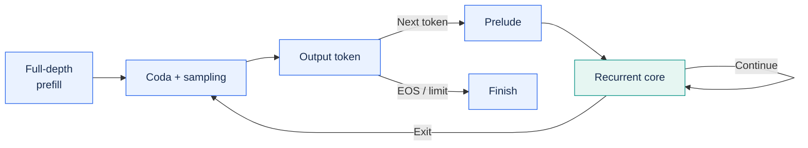

<h1 align="center">vllm-rlt</h1>

<p align="center">
  <a href="https://arxiv.org/abs/2608.09444"></a>
  <a href="LICENSE"></a>
  <a href="pyproject.toml"></a>
  <a href="#contributing"></a>
</p>

<p align="center">
  <strong>Loop-level continuous batching for recurrent language models.</strong>
</p>

<p align="center">
  <a href="https://arxiv.org/pdf/2608.09444">Paper</a> ·
  <a href="#how-it-works">How It Works</a> ·
  <a href="#getting-started">Getting Started</a> ·
  <a href="docs/README.md">Documentation</a> ·
  <a href="#performance-baselines">Performance</a> ·
  <a href="#roadmap">Roadmap</a> ·
  <a href="#contributing">Contributing</a>
</p>

## About

**vllm-rlt** is a standalone inference and serving engine for recurrent language
models, currently supporting **ByteDance/Ouro-1.4B**. It brings continuous
batching to individual recurrent loops, allowing requests at different loop
depths to share a batch as they work toward their next token.

Recurrent models reuse a shared transformer core multiple times per token.
With adaptive early exit, different tokens can require different amounts of
computation. vllm-rlt schedules work at these loop boundaries and manages KV
state by recurrence depth, so requests can leave and refill the batch without
waiting for an entire cohort to finish.

The project follows a vLLM-style engine organization and implements runtime
ideas from **Continuous Depth Batching (CDB)**, described in
[Depth-adaptive Inference of Looped Language Models via Continuous Depth
Batching](https://arxiv.org/pdf/2608.09444) by Kristian Schwethelm, Daniel
Rückert, and Georgios Kaissis (2026). It runs independently and does not require
vLLM to be installed. See [Citation](#citation) for the paper's BibTeX entry.

## Features

- **Loop-level continuous batching.** Mix requests at different recurrence
  depths, with refill and no-refill scheduling, chunked prefill, dynamic
  arrivals, and cancellation.
- **Adaptive computation.** Run fixed-depth decoding or use Ouro's trained
  early-exit gate, with per-request loop bounds and exit thresholds.
- **Depth-aware paged KV cache.** LAST-EXITED and SHARED layouts, automatic
  CUDA cache sizing, and optional prefix caching, incremental page allocation,
  priority scheduling, and preemption with CPU state snapshots.
- **Configurable GPU execution.** Triton and FlashAttention backends, asynchronous
  scheduling, multiple CUDA streams, reusable buffers, and CUDA Graph capture
  of decode recurrent cores.
- **Offline and online inference.** A Python API, a command-line interface,
  and an OpenAI-compatible completions endpoint with streaming, greedy decoding,
  and seeded top-k/top-p sampling.
- **Prefill/decode disaggregation.** Separate prefill and decode worker pools
  across GPUs on one host, with NIXL KV transfer and overlap between chunked
  prefill computation and transfer.

The default runtime uses synchronous execution and the original Ouro gate.
Advanced execution and cache features are opt-in; see the guides below for
supported combinations.

## How It Works

Full-depth prefill produces the first token through the coda. Each subsequent
token passes through the prelude and a variable number of recurrent loops
before sampling. Requests at different loop depths can share the same batch.



The diagram shows logical token flow; asynchronous execution can overlap
stages. See the [runtime guide](docs/cdb_runtime.md) for scheduling, exit policies,
and depth-aware KV caching.

<a href="docs/assets/inference/ouro-inference.mp4">
  <picture>
    <source media="(prefers-reduced-motion: reduce)" srcset="docs/assets/inference/ouro-inference.png">
    
  </picture>
</a>

The animation follows one request: four-loop prefill produces `y₀`, then
processing `y₀` with a two-loop adaptive exit produces `y₁`. Each loop reuses
the same 24-layer transformer core. Gate scores and timing are illustrative;
the default `exit_threshold=1.0` uses four loops.
[Watch the MP4](docs/assets/inference/ouro-inference.mp4) for smoother playback.

## Getting Started

Requires **Python 3.10+** and **PyTorch 2.5+**. For GPU inference, use Linux with
an NVIDIA GPU and a CUDA-enabled PyTorch installation compatible with your
hardware.

With your environment activated, use uv from the repository root to install
the project (text, serving, and Triton
support are included):

```bash
uv pip install -e .
```

For a fresh machine, follow the [step-by-step user guide](docs/launching.md):
create an environment, download the model, start the server, and send your first
request. The guide also covers command-line inference and the Python API. Browse the [documentation](docs/README.md) for runtime
configuration, optional backends, and design notes.

## Performance Baselines

The current performance baselines are recorded in
[PR #30: depth-aware KV and asynchronous execution](https://github.com/hsliuustc0106/vllm-rlt/pull/30)
and [PR #31: prefill/decode disaggregation](https://github.com/hsliuustc0106/vllm-rlt/pull/31).
These reports provide the reference measurements for subsequent runtime work.

### Single-GPU runtime

PR #30 evaluates feature stacking on Ouro-1.4B BF16 on B300. The figure
shows **relative engine end-to-end throughput** for 1,024-token inputs at
concurrency 1, 32, and 128. Each curve is normalized to its own FA4 baseline;
the legend includes absolute baseline throughput. Triton is excluded.


P1–P8 progressively add early exit, delayed exit, asynchronous scheduling,
multiple streams, static buffers, padding, and decode recurrent-core CUDA
Graphs. The shaded pair is the separate **FA4 split=1** rerun, comparing CUDA
Graphs with and without resident asynchronous state. Its normalization to the original
FA4 baseline is a cross-campaign comparison; only the shaded pair is matched.

Values are medians of three trials, with 128 output tokens per request and
2×concurrency requests using closed-loop replacement. Timing includes prefill
and drain time, excluding HTTP, tokenization, loading, and warmup. The vertical
axis is linear. P2→P3 changes the exit policy;
output and exit-depth differences remain unresolved in some configurations.
See [PR #30](https://github.com/hsliuustc0106/vllm-rlt/pull/30) for decode-only
results, latency tables, and the full protocol.

### Four-GPU serving

PR #31 compares four independent replicas with disaggregated prefill (P) and
decode (D) pools. Each configuration uses four GPUs, Ouro-1.4B BF16, FA4
split=1, asynchronous scheduling, CUDA Graphs, and the new KV/scheduling
features. Each phase replays 512 ShareGPT prompts with 128 output tokens.

Each figure compares all four configurations against **four replicas = 100%**.
Bar labels show the PR-reported percentage changes. Higher throughput is better;
lower latency is better. At 4 and 8 req/s, **2P2D retains 99.0% and 97.5% of
baseline throughput**, while reducing TTFT by **13.3% and 25.8%** and ITL by
**53.5% and 47.9%**, respectively.


Bars average the initial and immediate-replay phases equally; latency values
are averages of phase percentiles, not pooled percentiles. TTFT measures time
to first token, TPOT average time per subsequent token, ITL individual token
intervals, and E2E request completion latency. Some cases use isolated reruns
while others were measured with concurrent configurations on the same host;
see [PR #31](https://github.com/hsliuustc0106/vllm-rlt/pull/31) for the full protocol.

In this workload, 1P3D improves generation latency at the cost of TTFT, while
2P2D improves all reported latency metrics with slightly lower throughput.
These are fixed-arrival-rate measurements, not peak-capacity results, and do
not isolate the benefit of individual cache or scheduling features.

### Validation

See the [runtime validation and context/concurrency results](https://github.com/hsliuustc0106/vllm-rlt/pull/30)
and [GSM8K evaluation guide](docs/accuracy.md) for additional checks. The PRs above
are the public references for the reported performance results and limitations.

## Roadmap

We are refactoring module boundaries and state ownership while preserving
loop-level scheduling and KV semantics. See [RFC #32](https://github.com/hsliuustc0106/vllm-rlt/issues/32)
for the target architecture, module breakdown, and implementation sequence.

<a id="contributing"></a>

## 🤝 Contributing

Help us build efficient inference for recurrent language models. vllm-rlt is
open to contributors working on systems, models, evaluation, and documentation.
A reproducible bug report, a carefully measured experiment, or a clearer example
can be just as useful as a runtime optimization.

- 🛠️ **Improve the engine.** Work on loop-level scheduling, attention, KV caching,
  or prefill/decode disaggregation. The [architecture RFC and refactoring roadmap](https://github.com/hsliuustc0106/vllm-rlt/issues/32)
  describe the current priorities and module boundaries.
- 📊 **Bring evidence.** Test your workloads and hardware, investigate numerical
  differences, or contribute reproducible benchmarks. Include your configuration
  and correctness checks so others can build on your results.
- 📖 **Make it easier to use.** Improve installation instructions, explain a
  runtime behavior, or turn a working example into a guide for the next user.

**Have an idea or found a problem?** [Open an issue](https://github.com/hsliuustc0106/vllm-rlt/issues/new)
with the details, or [send a pull request](https://github.com/hsliuustc0106/vllm-rlt/compare).
For larger changes, start a discussion in an issue so we can work through the
design together. If you are new to the codebase, tell us what interests you—we
can help identify a useful starting point.

You can also scan the QR code below with WeChat to join the vllm-rlt developer
group and discuss usage and development.

<p align="center">
  <a href="docs/assets/wechat-group-qrcode.jpg">
    
  </a>
</p>

## Acknowledgments

vllm-rlt builds on the published Ouro architecture and the ideas in
[Continuous Depth Batching](https://arxiv.org/abs/2608.09444). Its engine and
Python API organization are inspired by [vLLM](https://github.com/vllm-project/vllm).
See [NOTICE](NOTICE) for upstream model attribution.

## Citation

For the CDB method that informs this project, please cite the original paper:
[Depth-adaptive Inference of Looped Language Models via Continuous Depth
Batching](https://arxiv.org/abs/2608.09444)
([PDF](https://arxiv.org/pdf/2608.09444)).

```bibtex
@misc{schwethelm2026continuousdepthbatching,
  title = {Depth-adaptive Inference of Looped Language Models via Continuous Depth Batching},
  author = {Kristian Schwethelm and Daniel R\"{u}ckert and Georgios Kaissis},
  year = {2026},
  eprint = {2608.09444},
  archivePrefix = {arXiv},
  primaryClass = {cs.LG},
  url = {https://arxiv.org/abs/2608.09444}
}
```

The paper's measurements are separate from the vllm-rlt performance baselines
reported above.

## Contributing with Codex

Use [$vllm-lt-contribute](.agents/skills/vllm-lt-contribute/SKILL.md) to plan,
implement and validate a contribution. Use
[$vllm-lt-review-pr](.agents/skills/vllm-lt-review-pr/SKILL.md) for a standalone
review or requested self-review. Both skills live in this repository and share
the detailed review criteria.

## License

[Apache License 2.0](LICENSE).
