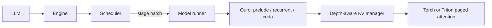

# vllm-lt

A standalone inference engine for **ByteDance/Ouro-1.4B**, organized like vLLM,
with continuous batching at **individual recurrent-loop boundaries** and a
depth-aware paged KV cache. Based on
[Continuous Depth Batching (CDB)](https://arxiv.org/abs/2608.09444).

The engine supports native checkpoint loading, full-depth
chunked prefill, adaptive decode, refill/no-refill scheduling, greedy and
seeded top-k/top-p sampling, streaming engine steps, cancellation, and a Triton
paged-attention backend. CPU execution provides a reference backend.

It is a synchronous, single-device implementation. The paper's asynchronous
lookahead scheduling, CUDA graphs, distributed execution, prefix sharing,
and preemption are not implemented. A bounded OpenAI completions frontend is
available; see the [serving guide](docs/serving.md).

BF16 is the default for checkpoint loading and offline inference.
Use `--dtype float32` or `dtype=torch.float32` for FP32 diagnostics.

## Install and run

Python 3.10+ and PyTorch 2.5+ are required. Use an appropriate existing environment
or create a virtual environment, then install:

```bash
python -m pip install -e '.[text,triton,dev]'
```

For a CPU smoke test with a **tiny, randomly initialized** Ouro architecture:

```bash
OMP_NUM_THREADS=1 python -m vllm_lt.entrypoints.cli --toy --max-tokens 4 --exit-threshold 0.7
```

For the pretrained model on a GPU, run inside your scheduler's reservation.
Choose an available exact device ID from its status output:

```bash
gpu status
gpu run --gpu-ids <available-id> --timeout 20m --note "vllm-lt Ouro inference" -- \
  python -m vllm_lt.entrypoints.cli \
  --model ByteDance/Ouro-1.4B --device cuda \
  --attention-backend triton --prompt 'The capital of France is' \
  --prompt '2 + 2 =' --max-tokens 32 --exit-threshold 0.7
```

Omit the scheduler wrapper on a dedicated machine without a GPU reservation
system. The engine leaves device visibility to the caller. The official model
and tokenizer default to immutable revision
`574fa66cb8bf5abdc979642d01cf2b79b16bfab1`; `--model` also accepts a local checkpoint
directory. Loading uses native code and safetensors, without `trust_remote_code`.

## Python API

```python
from vllm_lt import LLM, CacheConfig, SamplingParams, SchedulerConfig
from vllm_lt.models import OuroConfig, OuroForCausalLM

# Small CPU example. This model has random weights, not pretrained language ability.
model = OuroForCausalLM(OuroConfig.tiny()).bfloat16()
llm = LLM(
    model,
    cache_config=CacheConfig(num_blocks=64, block_size=4),
    scheduler_config=SchedulerConfig(mode="refill", max_num_seqs=4),
)
outputs = llm.generate(
    [[1, 2, 3], [4, 5]],
    SamplingParams(max_tokens=8, min_loops=2, max_loops=4, exit_threshold=0.7, ignore_eos=True),
)
for output in outputs:
    print(output.token_ids, output.exit_depths, output.finish_reason)
```

Use `LLM("ByteDance/Ouro-1.4B", device="cuda",
attention_backend="triton")` inside a reservation for pretrained text prompts.
When passed an existing model object, `LLM` preserves its dtype. Engine KV storage
uses the model's dtype.

The facade accepts a list of text prompts or a list of token-ID lists, and one
`SamplingParams` object or one per prompt. Outputs preserve input order.

For dynamic arrivals, call `llm.engine.add_request(id, token_ids, params)`, then
`llm.engine.step()` repeatedly. Each step executes one scheduled stage and returns
cumulative `RequestOutput` objects when the coda samples tokens. Add new requests
between steps, and call `abort_request(id)` to cancel. `has_unfinished_requests()`
indicates whether work remains. The engine API is synchronous and is not thread-safe.

## Architecture and semantics



Refill interleaves requests at different loop depths; no-refill drains a recurrent
cohort before starting the next. Prompt chunks run all loops, so the first
`exit_depths` entry records full prefill depth. Decode uses cumulative gate
probability, with a minimum of two loops; `exit_threshold=1.0` disables early exit.

KV pages are separate for each request and depth. Early exit copies each layer's
final KV into skipped depths. Admission reserves
`ceil((prompt_tokens + max_tokens - 1) / block_size) * model_loops` pages per request.
Oversized requests are rejected; temporary pressure queues requests until pages
are released. The default BF16 Ouro cache uses 768 MiB (256 pages, 16 tokens).
See [engine design](docs/design.md) for ownership, scheduling, and KV invariants.

## Tests

```bash
OMP_NUM_THREADS=1 python -m pytest -q
python -m ruff check .
python -m ruff format --check .

# CUDA tests are opt-in and must run inside a reservation on a shared host.
gpu run --gpu-ids <available-id> --timeout 10m --note "vllm-lt kernel tests" -- \
  python -m pytest -q tests/test_attention.py --run-gpu
```

Core tests cover model numerics against a dense reference, attention, KV isolation
and reuse, scheduling, cancellation, checkpoint loading, and sampling.
Inactive-row tests cover masked attention/KV writes, poisoned padding, live-state
publication, sampling isolation and compact-versus-padded execution.
The one-off milestone harnesses and their tests have been removed.

Historical [numerical results](https://github.com/hsliuustc0106/vllm-lt/blob/f0dfe5f71b83965a86fbda9cece3cb94dd0389ec/docs/validation.md)
include passing FP32 comparisons and BF16 logit-tolerance failures. Measurements
and further reports are preserved in the
[experiment archive](https://github.com/hsliuustc0106/vllm-lt/releases/tag/implementation-notes-archive-20260913).

For end-to-end accuracy, use the [GSM8K evaluation guide](docs/accuracy.md) to
run the fixed 87-question regression case. Its measured official Transformers
baseline is **59/87 (67.82%)**, matched by BF16 native inference.

## License

Apache-2.0; see [LICENSE](LICENSE) and [NOTICE](NOTICE). The native model adapts
the published Ouro architecture and preserves upstream attribution.
