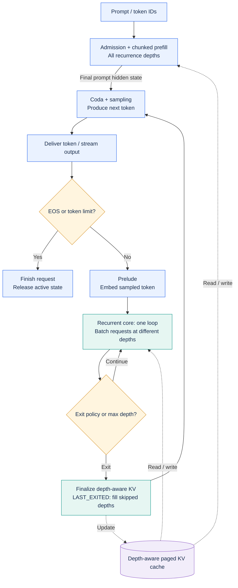
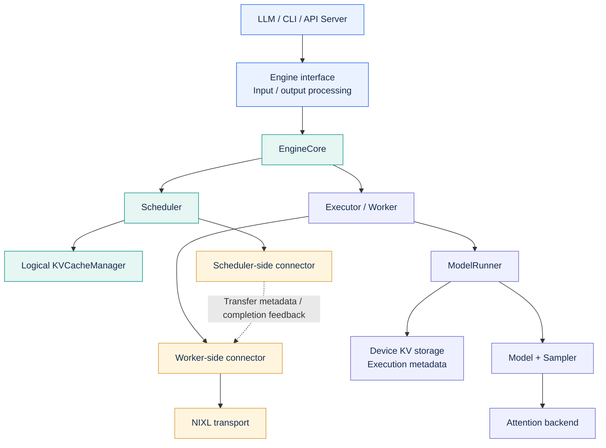

<h1 align="center">vllm-rlt</h1>

<p align="center">
  <a href="https://arxiv.org/abs/2608.09444"></a>
  <a href="LICENSE"></a>
  <a href="pyproject.toml"></a>
  <a href="#contributing"></a>
</p>

<p align="center">
  <strong>Loop-level continuous batching for recurrent language models.</strong>
</p>

<p align="center">
  <a href="https://arxiv.org/pdf/2608.09444">Paper</a> ·
  <a href="#how-it-works">How It Works</a> ·
  <a href="#getting-started">Getting Started</a> ·
  <a href="#serving">Serving</a> ·
  <a href="#documentation">Documentation</a> ·
  <a href="#performance-baselines">Performance</a> ·
  <a href="#roadmap">Roadmap</a> ·
  <a href="#contributing">Contributing</a>
</p>

## About

**vllm-rlt** is a standalone inference and serving engine for recurrent language
models, currently supporting **ByteDance/Ouro-1.4B**. It brings continuous
batching to individual recurrent loops, allowing requests at different loop
depths to share a batch as they work toward their next token.

Recurrent models reuse a shared transformer core multiple times per token.
With adaptive early exit, different tokens can require different amounts of
computation. vllm-rlt schedules work at these loop boundaries and manages KV
state by recurrence depth, so requests can leave and refill the batch without
waiting for an entire cohort to finish.

The project follows a vLLM-style engine organization and implements runtime
ideas from **Continuous Depth Batching (CDB)**, described in
[Depth-adaptive Inference of Looped Language Models via Continuous Depth
Batching](https://arxiv.org/pdf/2608.09444) by Kristian Schwethelm, Daniel
Rückert, and Georgios Kaissis (2026). It runs independently and does not require
vLLM to be installed. See [Citation](#citation) for the paper's BibTeX entry.

## Features

- **Loop-level continuous batching.** Mix requests at different recurrence
  depths, with refill and no-refill scheduling, chunked prefill, dynamic
  arrivals, and cancellation.
- **Adaptive computation.** Run fixed-depth decoding or use Ouro's trained
  early-exit gate, with per-request loop bounds and exit thresholds.
- **Depth-aware paged KV cache.** LAST-EXITED and SHARED layouts, automatic
  CUDA cache sizing, and optional prefix caching, incremental page allocation,
  priority scheduling, and preemption with CPU state snapshots.
- **Configurable GPU execution.** Triton and FlashAttention backends, asynchronous
  scheduling, multiple CUDA streams, reusable buffers, and CUDA Graph capture
  of decode recurrent cores.
- **Offline and online inference.** A Python API, a command-line interface,
  and an OpenAI-compatible completions endpoint with streaming, greedy decoding,
  and seeded top-k/top-p sampling.
- **Prefill/decode disaggregation.** Separate prefill and decode worker pools
  across GPUs on one host, with NIXL KV transfer and overlap between chunked
  prefill computation and transfer.

The default runtime uses synchronous execution and the original Ouro gate.
Advanced execution and cache features are opt-in; see the guides below for
supported combinations.

## How It Works

Each request starts with full-depth prompt prefill. Its final hidden state goes
directly to the coda to produce the first token. Subsequent tokens pass through
the prelude, a variable number of recurrent loops, and the coda. The scheduler
batches each stage independently, allowing requests at different loop depths
to execute the shared recurrent core together.



This is the logical request flow. In refill mode, an exited token frees space
for another token while other requests continue looping. Asynchronous execution
can overlap stages and advance device work ahead of host output delivery;
`ouro_delayed` consumes exit decisions with a one-loop delay. See the
[runtime guide](docs/cdb_runtime.md) for exit policies and cache layouts.

## Getting Started

### Installation

Requires **Python 3.10+** and **PyTorch 2.5+**. For GPU inference, use Linux with
an NVIDIA GPU and a CUDA-enabled PyTorch installation compatible with your
hardware.

From the repository root, install the engine with text, serving, and Triton
support:

```bash
python -m pip install -e '.[text,serve,triton]'
```

When upgrading from `vllm-lt`, uninstall it with `python -m pip uninstall vllm-lt`
before installing this checkout. Update Python imports from `vllm_lt` to
`vllm_rlt` and command names to `vllm-rlt`, `vllm-rlt-serve`, and
`vllm-rlt-pd-serve`.

FlashAttention and NIXL are optional; see the
[FlashAttention](https://github.com/hsliuustc0106/vllm-rlt/pull/30) and
[prefill/decode disaggregation](https://github.com/hsliuustc0106/vllm-rlt/pull/31) implementation notes for details.

### Offline inference

```bash
vllm-rlt \
  --model ByteDance/Ouro-1.4B \
  --device cuda \
  --attention-backend triton \
  --prompt 'The capital of France is' \
  --prompt '2 + 2 =' \
  --max-tokens 32 \
  --exit-threshold 0.7
```

Repeat `--prompt` to submit a batch. `--model` also accepts a local checkpoint
directory. BF16 is the default; the official model and tokenizer are pinned to
revision `574fa66cb8bf5abdc979642d01cf2b79b16bfab1`. Model loading uses native
code and safetensors, without `trust_remote_code`.

To check the installation without downloading weights or using a GPU:

```bash
OMP_NUM_THREADS=1 vllm-rlt --toy --max-tokens 4 --exit-threshold 0.7
```

The toy model is tiny and randomly initialized; it checks engine execution,
not language quality. On shared GPU hosts, run GPU examples through your local
reservation system and set device visibility for the allocated GPUs.

### Python API

```python
from vllm_rlt import LLM, SamplingParams

llm = LLM(
    "ByteDance/Ouro-1.4B",
    device="cuda",
    attention_backend="triton",
)

outputs = llm.generate(
    ["The capital of France is", "2 + 2 ="],
    SamplingParams(
        max_tokens=32,
        temperature=0.0,
        min_loops=2,
        max_loops=4,
        exit_threshold=0.7,
    ),
)

for output in outputs:
    print(output.text)
    print("Exit depths:", output.exit_depths)
```

The API accepts text prompts or token-ID lists and returns results in input
order. Prompt prefill runs at full depth; the exit threshold controls subsequent
decode. Set `exit_threshold=1.0` for fixed-depth execution. The first generated
token comes from full-depth prefill, which is reflected in `exit_depths`.

For dynamic arrivals and step-by-step output, use `llm.engine.add_request(...)`,
`llm.engine.step()`, and `llm.engine.abort_request(...)`. See the
[engine design](docs/design.md) for the execution model.

## Serving

Start a resident model:

```bash
vllm-rlt-serve \
  --model ByteDance/Ouro-1.4B \
  --device cuda \
  --attention-backend triton \
  --host 127.0.0.1 \
  --port 8000
```

Send a streaming completion request:

```bash
curl -N http://127.0.0.1:8000/v1/completions \
  -H 'Content-Type: application/json' \
  -d '{
    "model": "ByteDance/Ouro-1.4B",
    "prompt": "The capital of France is",
    "max_tokens": 32,
    "temperature": 0,
    "exit_threshold": 0.7,
    "stream": true
  }'
```

Concurrent requests share continuous engine batching. The server also exposes
`GET /health` and `GET /v1/models`. It implements a bounded subset of the
OpenAI completions API; chat completions are not implemented. See the
[serving guide](docs/serving.md) for supported fields, request limits, and
benchmark client usage.

## Documentation

| Guide | Topics |
| --- | --- |
| [Engine design](docs/design.md) | Model stages, scheduling, and KV ownership |
| [Scheduler walkthrough](docs/scheduler_walkthrough.md) | Responsibilities, admission cases, control flow, and refactoring checklist |
| [KV layout examples](docs/kv_layout_computation.md) | SHARED and LAST_EXITED semantics and worked attention examples |
| [Runtime configuration](docs/cdb_runtime.md) | Exit policies, KV layouts, execution options, and CUDA Graphs |
| [Asynchronous scheduling](https://github.com/hsliuustc0106/vllm-rlt/pull/30) | CPU/GPU pipelining and single-stream or multi-stream execution |
| [FlashAttention](https://github.com/hsliuustc0106/vllm-rlt/pull/30) | FA2/FA3/FA4 installation, hardware selection, and constraints |
| [Cache and scheduling features](https://github.com/hsliuustc0106/vllm-rlt/pull/31) | Prefix reuse, incremental KV, priorities, and preemption |
| [Prefill/decode disaggregation](https://github.com/hsliuustc0106/vllm-rlt/pull/31) | Single-host GPU worker pools and NIXL transfer |
| [HTTP serving](docs/serving.md) | Completions API, streaming, and service lifecycle |
| [Accuracy evaluation](docs/accuracy.md) | GSM8K regression setup and comparison methodology |

Current model support is limited to Ouro-1.4B. CPU execution provides a Torch
reference backend. FlashAttention hardware validation is currently documented
for FA4 on B300; FA2/FA3 require validation on their target devices. Disaggregated
serving currently targets multiple GPUs on a single host.

`ouro_delayed` reuses the trained Ouro gate with a one-loop delay; it changes
the exit policy. The `random_lookahead` mode uses an untrained head for runtime
experiments. Neither is a distilled lookahead predictor.

## Performance Baselines

The current performance baselines are recorded in
[PR #30: depth-aware KV and asynchronous execution](https://github.com/hsliuustc0106/vllm-rlt/pull/30)
and [PR #31: prefill/decode disaggregation](https://github.com/hsliuustc0106/vllm-rlt/pull/31).
These reports provide the reference measurements for subsequent runtime work.

### Single-GPU runtime

PR #30 evaluates feature stacking on Ouro-1.4B BF16 on B300. The figure
shows **relative engine end-to-end throughput** for 1,024-token inputs at
concurrency 1, 32, and 128. Each curve is normalized to its own FA4 baseline;
the legend includes absolute baseline throughput. Triton is excluded.


P1–P8 progressively add early exit, delayed exit, asynchronous scheduling,
multiple streams, static buffers, padding, and decode recurrent-core CUDA
Graphs. The shaded pair is the separate **FA4 split=1** rerun, comparing CUDA
Graphs with and without resident asynchronous state. Its normalization to the original
FA4 baseline is a cross-campaign comparison; only the shaded pair is matched.

Values are medians of three trials, with 128 output tokens per request and
2×concurrency requests using closed-loop replacement. Timing includes prefill
and drain time, excluding HTTP, tokenization, loading, and warmup. The vertical
axis is linear. P2→P3 changes the exit policy;
output and exit-depth differences remain unresolved in some configurations.
See [PR #30](https://github.com/hsliuustc0106/vllm-rlt/pull/30) for decode-only
results, latency tables, and the full protocol.

### Four-GPU serving

PR #31 compares four independent replicas with disaggregated prefill (P) and
decode (D) pools. Each configuration uses four GPUs, Ouro-1.4B BF16, FA4
split=1, asynchronous scheduling, CUDA Graphs, and the new KV/scheduling
features. Each phase replays 512 ShareGPT prompts with 128 output tokens.

Each figure compares all four configurations against **four replicas = 100%**.
Bar labels show the PR-reported percentage changes. Higher throughput is better;
lower latency is better. At 4 and 8 req/s, **2P2D retains 99.0% and 97.5% of
baseline throughput**, while reducing TTFT by **13.3% and 25.8%** and ITL by
**53.5% and 47.9%**, respectively.


Bars average the initial and immediate-replay phases equally; latency values
are averages of phase percentiles, not pooled percentiles. TTFT measures time
to first token, TPOT average time per subsequent token, ITL individual token
intervals, and E2E request completion latency. Some cases use isolated reruns
while others were measured with concurrent configurations on the same host;
see [PR #31](https://github.com/hsliuustc0106/vllm-rlt/pull/31) for the full protocol.

In this workload, 1P3D improves generation latency at the cost of TTFT, while
2P2D improves all reported latency metrics with slightly lower throughput.
These are fixed-arrival-rate measurements, not peak-capacity results, and do
not isolate the benefit of individual cache or scheduling features.

### Validation

See the [runtime validation and context/concurrency results](https://github.com/hsliuustc0106/vllm-rlt/pull/30)
and [GSM8K evaluation guide](docs/accuracy.md) for additional checks. The PRs above
are the public references for the reported performance results and limitations.

## Roadmap

The next development focus is **modular architecture refactoring**, tracked in
[RFC #32](https://github.com/hsliuustc0106/vllm-rlt/issues/32). The goal is to make
state ownership and module interfaces explicit while preserving loop-level
batching, exit policies, depth-aware KV semantics, and PD handoff behavior.

The first scheduler-responsibility refactor landed in
[PR #34](https://github.com/hsliuustc0106/vllm-rlt/pull/34); the broader architecture
migration remains in progress.

### Target Architecture

The following diagram follows [RFC #32](https://github.com/hsliuustc0106/vllm-rlt/issues/32).
It describes the **planned refactoring architecture**, rather than a completed
migration of the current code.



The scheduler owns logical request progression, while the worker and runner
own device state. EngineCore drives the feedback loop:
`schedule()` → `SchedulerOutput` → execution → `ModelRunnerOutput` →
`update_from_output()`. Logical KV management tracks allocation and lifetimes;
device storage and attention execute behind separate interfaces. The PD
coordinator sits above the prefill/decode engines; scheduler-side and
worker-side connectors handle their transfer contracts.

The planned work includes:

- Establish a scheduler/execution feedback loop: the scheduler owns logical
  request progress and exit decisions; EngineCore orchestrates submission and
  result collection; workers own device execution state.
- Separate logical KV allocation, references, and transfer leases from device
  storage, copies, and attention execution.
- Replace direct access to private queues and mutable state with explicit
  scheduling results, execution results, frontend APIs, and PD connectors.
- Refactor incrementally, validating cancellation, late results, preemption,
  transfer cleanup, numerical behavior, and performance against pinned baselines.

The latest order recorded in the RFC is **Scheduler (M3) → EngineCore (M2) →
logical KV (M4) → Attention (M8) → Executor/Worker/ModelRunner (M5) → Sampling
(M7) → Model (M6) → PD/transfer (M9) → Entrypoints (M1)**.

This is planned work. vLLM V1 serves as an architectural reference; the engine
will remain standalone. Each module review will pin its own reproducible
baseline and validate relevant throughput, latency, and memory behavior.

<a id="contributing"></a>

## 🤝 Contributing

Help us build efficient inference for recurrent language models. vllm-rlt is
open to contributors working on systems, models, evaluation, and documentation.
A reproducible bug report, a carefully measured experiment, or a clearer example
can be just as useful as a runtime optimization.

- 🛠️ **Improve the engine.** Work on loop-level scheduling, attention, KV caching,
  or prefill/decode disaggregation. The [architecture RFC and refactoring roadmap](https://github.com/hsliuustc0106/vllm-rlt/issues/32)
  describe the current priorities and module boundaries.
- 📊 **Bring evidence.** Test your workloads and hardware, investigate numerical
  differences, or contribute reproducible benchmarks. Include your configuration
  and correctness checks so others can build on your results.
- 📖 **Make it easier to use.** Improve installation instructions, explain a
  runtime behavior, or turn a working example into a guide for the next user.

**Have an idea or found a problem?** [Open an issue](https://github.com/hsliuustc0106/vllm-rlt/issues/new)
with the details, or [send a pull request](https://github.com/hsliuustc0106/vllm-rlt/compare).
For larger changes, start a discussion in an issue so we can work through the
design together. If you are new to the codebase, tell us what interests you—we
can help identify a useful starting point.

## Acknowledgments

vllm-rlt builds on the published Ouro architecture and the ideas in
[Continuous Depth Batching](https://arxiv.org/abs/2608.09444). Its engine and
Python API organization are inspired by [vLLM](https://github.com/vllm-project/vllm).
See [NOTICE](NOTICE) for upstream model attribution.

## Citation

For the CDB method that informs this project, please cite the original paper:
[Depth-adaptive Inference of Looped Language Models via Continuous Depth
Batching](https://arxiv.org/abs/2608.09444)
([PDF](https://arxiv.org/pdf/2608.09444)).

```bibtex
@misc{schwethelm2026continuousdepthbatching,
  title = {Depth-adaptive Inference of Looped Language Models via Continuous Depth Batching},
  author = {Kristian Schwethelm and Daniel R\"{u}ckert and Georgios Kaissis},
  year = {2026},
  eprint = {2608.09444},
  archivePrefix = {arXiv},
  primaryClass = {cs.LG},
  url = {https://arxiv.org/abs/2608.09444}
}
```

The paper's measurements are separate from the vllm-rlt performance baselines
reported above.

## License

[Apache License 2.0](LICENSE).
