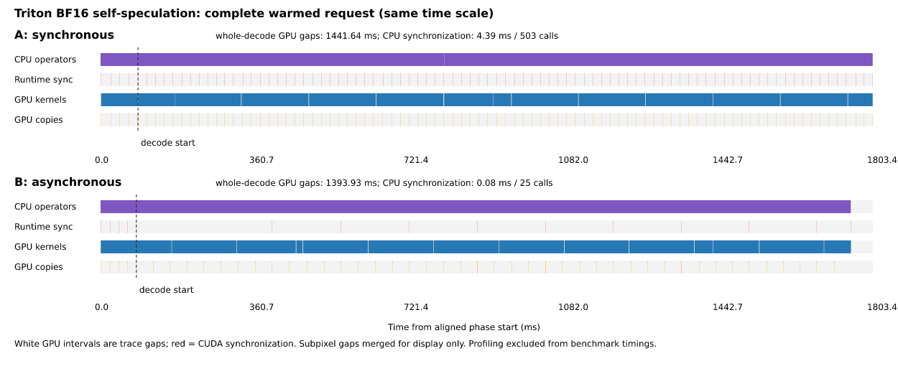
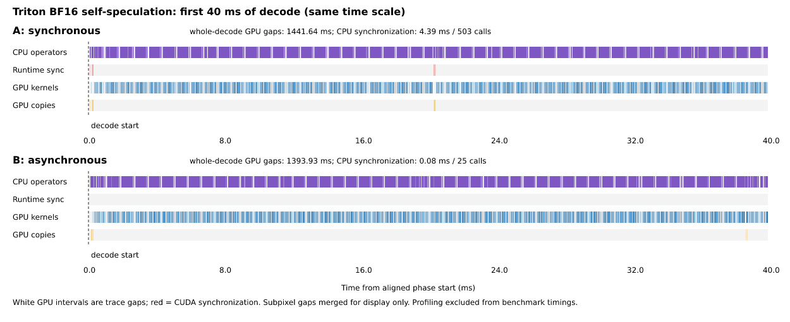

# Triton asynchronous self-speculation: validation record

## Scope and source

This records validation of the opt-in, cross-round greedy path described in
[async-speculative.md](async-speculative.md). The GPU experiments below were
run on 2026-09-23 against PR44's
`d9fca507e766e81f5d89f90d598881c12d7d8397` plus the asynchronous implementation.
Runtime and benchmark SHA256 hashes are embedded in each result JSON. The local
measured source snapshot and modified file manifest are retained under
`/home/leo/slurm-logs/rlt-async-spec/`; these raw artifacts are not bundled with
the repository.

On 2026-09-28 the feature branch was advanced to upstream main
`09f229a1f513dfbf13b2a1060dbc900f1f3543d8`, which includes PR44 and the sampling
module refactor. All 14 local modified/untracked files were restored byte for
byte. The focused CPU regression (`test_sampler`, `test_engine`,
`test_speculative`, and `test_async_speculative`, with GPU tests deselected)
passed 85 tests. GPU correctness and performance have not been rerun on this
new base; the measurements below qualify the earlier snapshot only.

For draft PR preparation on the new base, `pre-commit run --all-files` passed
Ruff lint, Ruff format and the full CPU regression suite (GPU tests skipped by
default). Ruff formatting of the nine changed Python files preserved their
parsed ASTs. No new GPU performance claim is made for the rebased snapshot.

The experiment uses the real local Ouro-1.4B checkpoint, BF16 weights/activations/KV,
Triton attention, one H20-3e on `vllm-h20-02`, and `d=2, D=4`. The model has
24 shared transformer layers, hidden size 2048, 16 attention/KV heads and head
dimension 128; TP=1. Model weight/config hashes are in each result. Native async
uses `ouro_delayed` with threshold 1, which disables early exits in this runtime;
speculative paths use fixed-depth `ouro`.

## Correctness and lifecycle coverage

| Requirement | Evidence |
| --- | --- |
| CUDA + Triton only | CPU rejection and GPU backend rejection tests |
| Actual next position remains on GPU across rounds | Submit two rounds with `Tensor.item` and `Tensor.tolist` forbidden; check every rejection position and full acceptance |
| Old CPU delivery cannot rewind newer KV | Device position checked before and after collecting the older result |
| KV matches the committed token history | FP32 and BF16 two-round comparison at every physical layer and recurrent depth against serial replay |
| Ragged requests, small scheduling budgets, output boundaries | K=1/2/4/8, budget=1/7/16/32, mixed prompt/output lengths |
| Prefix reuse and incremental allocation | Repeated requests with prefix caching and incremental page allocation |
| Refill with fresh requests during in-flight decode | New chunked prefill arrivals after two submitted rounds |
| EOS, cancellation and ID reuse | Discard queued suffixes, preserve allocation lifetime, isolate old request objects |
| Submission failure and shutdown | Partial failure cleanup; close two outstanding rounds with both stream settings |
| Greedy-only contract | Reject nonzero temperature |
| HTTP nonstreaming and streaming | Controlled full acceptance delivers the complete suffix and correct usage |
| Existing behavior | Full CPU regression and related GPU async/sync speculative/serving regression |

The GPU KV tolerance is declared in the test: FP32 `atol=rtol=4e-5`, BF16
`atol=0.08, rtol=0.04`. Output IDs require exact equality. This is a targeted
correctness qualification, not a model-quality benchmark.

CPU command:

```bash
.venv/bin/python -m pytest -m 'not gpu' -q
```

Result: **289 passed, 11 skipped**. GPU tests are deliberately deselected in
that run. The retained JUnit report is `cpu-final.xml`.

Related GPU regression command (Slurm job 3850):

```bash
.venv/bin/python -m pytest tests/test_async_speculative.py \
  tests/test_speculative.py tests/test_async_pipeline.py \
  tests/test_async_state.py tests/test_serving.py \
  --run-gpu -k 'not flash_attn_4' -q
```

Result: **145 passed, 3 deselected**. An earlier all-backend invocation (job 3848)
reported 145 passes, one skip and two failures loading the absent `flash_attn`
package. Those failures belong to existing FA4 tests; FA4 is outside this path's
support scope. They are retained as environment failures, not silently counted
as passes. The final focused GPU run (job 3855) passed **24 tests**, including the new
tests that explicitly reject other backends before attention loading. Its
`gpu-final.xml` is retained. Job 3855 subsequently failed in the trace-analysis
helper because CPU and GPU annotations shared a name. Selecting the CPU
annotation fixed that helper; CPU-only job 3861 completed the analysis. No
runtime code or captured trace needed to change.

## Measurement protocol

Slurm job 3850 runs the repository benchmark entry point
`python -m benchmarks.async_speculative` against `artifacts/models/Ouro-1.4B`.
All three modes run in the same allocation. Each observation gets its own engine
and warmup. Order alternates native/sync/async and async/sync/native. Five measured
observations are retained per cell; profiling is separate. The fixed English
prompt is repeated/truncated to the requested length, identical across concurrent
requests. EOS is ignored to guarantee matched output lengths.

The timed interval starts after every request's first output and ends after
completion and GPU synchronization. Throughput counts only the remaining
committed output tokens. This is engine decode throughput, not TTFT or HTTP
throughput. JSON also retains per-delivery timestamps and peak allocated/reserved
GPU memory. Accepted arguments are backed by GPU execution tests; output mismatch
makes the benchmark exit with an error after preserving its raw observations.

- Short case: 64 prompt tokens, 32 output tokens; concurrency 1/8; K=1/2/4/8.
- Longer case: 512 prompt tokens, 128 output tokens; concurrency 1/32; K=2.
- Profile case: short case, concurrency 1, K=2, separate warmed sync/async captures.

## Results

All **150 measured trials** (120 short + 30 longer) completed with exact token
agreement against the matched native path. Three additional observations in the
profile job also matched; they are excluded from the table below to preserve the
five-repeat protocol. All runtime and benchmark hashes were checked against the
2026-09-23 measured working tree.

Throughput is committed decode tokens/s, shown as median `[min, max]` over five
observations. The final column compares async speculation with sync speculation.
These ranges describe the observed runs, not confidence intervals.

| Prompt/output | Concurrency | K | Native async | Sync spec | Async spec | Async/sync gain |
| --- | ---: | ---: | ---: | ---: | ---: | ---: |
| 64/32 | 1 | 1 | 19.82 [19.74, 20.09] | 26.80 [26.68, 27.04] | 27.70 [27.04, 27.83] | +3.4% |
| 64/32 | 1 | 2 | 19.91 [19.83, 19.98] | 30.06 [29.67, 30.13] | 30.72 [30.58, 30.83] | +2.2% |
| 64/32 | 1 | 4 | 19.90 [19.83, 20.00] | 33.46 [33.30, 33.50] | 34.46 [34.37, 34.60] | +3.0% |
| 64/32 | 1 | 8 | 19.92 [19.89, 20.01] | 36.48 [36.23, 36.83] | 37.87 [37.47, 38.07] | +3.8% |
| 64/32 | 8 | 1 | 156.69 [154.97, 158.18] | 207.06 [206.47, 211.72] | 216.65 [215.69, 222.13] | +4.6% |
| 64/32 | 8 | 2 | 159.04 [156.63, 159.69] | 234.64 [230.22, 235.66] | 248.41 [245.01, 248.59] | +5.9% |
| 64/32 | 8 | 4 | 156.09 [154.57, 157.24] | 256.23 [254.39, 257.54] | 271.33 [270.83, 272.62] | +5.9% |
| 64/32 | 8 | 8 | 156.51 [154.94, 157.05] | 277.20 [277.11, 277.84] | 295.62 [294.83, 295.76] | +6.6% |
| 512/128 | 1 | 2 | 19.56 [19.50, 19.84] | 27.07 [26.83, 27.26] | 27.90 [27.68, 28.04] | +3.1% |
| 512/128 | 32 | 2 | 563.26 [561.55, 566.09] | 731.83 [726.46, 732.91] | 837.98 [836.99, 843.34] | +14.5% |

The largest observed allocated-memory peaks were 18.342 GiB for sync speculation
and 18.657 GiB for async speculation (longer case, concurrency 32, K=2). This
implementation retains device state and pinned/device banks; it does not claim a
memory reduction. JSON also contains reserved-memory peaks for every observation.

## Separate profiling analysis

The diagnostic capture is the warmed short workload at concurrency 1, K=2.
`measured_decode` is selected from the CPU `user_annotation` track; PyTorch also
emits a GPU annotation with the same name. GPU-active time is the union of kernel
and copy intervals clipped to that CPU decode range. GPU gap is the remainder,
including dispatch gaps and boundary waiting. These profiled durations include
instrumentation overhead and must not replace the unprofiled throughput table.

| Decode observation | Sync spec | Async spec |
| --- | ---: | ---: |
| Wall time (ms) | 1716.04 | 1668.54 |
| GPU active union (ms) | 274.40 | 274.61 |
| GPU gaps (ms) | 1441.64 | 1393.93 |
| Kernel count | 116295 | 116977 |
| CUDA launch calls | 100136 | 100829 |
| CUDA synchronization calls | 503 | 25 |
| CPU time inside CUDA synchronization (ms) | 4.389 | 0.083 |
| CPU `aten::item` calls | 51 | 0 |
| H2D copies | 451 pageable | 12 pinned |
| D2H copies | 51 | 10 |

Prefill plus first-token preparation occupies 87.37/83.62 ms in the two profiled
captures; its GPU active time is 19.73 ms in both. No prefill speed claim is made.
The full figure starts at the first recorded CPU operator and marks decode start;
the zoom aligns the first 40 ms of decode. Both use identical scales and equivalent
CPU, CUDA synchronization, GPU-kernel and GPU-copy tracks.





GPU active time is essentially unchanged. The device-owned frontier removes
candidate/acceptance scalar reads and replaces repeated pageable metadata uploads
with a per-round pinned table snapshot. That matches the reduced synchronization
and copy counts. Extra device bookkeeping slightly increases launch/kernel counts.
The captured decode gap falls by 47.71 ms, whereas time blocked inside CUDA
synchronization falls by only 4.31 ms: the entire difference cannot be attributed
to blocking waits alone. Reduced host coordination is consistent with the measured
speedup; one profiled pair does not isolate every component of that difference.
The eager path remains dominated by launch/dispatch gaps in this trace.

Layer reports use `_paged_attention_kernel` as one anchor per physical layer and
24 anchors per core pass. The selected pass 5 is the second draft loop of the
first decode round, after the four prefill passes; this is a warmed capture,
regardless of the generic analyzer's automatic `cold-start` label on pass 0.
Anchor spans cross module boundaries and are navigation aids, not exact module
hook timings. Representative kernel reports and all-pass tables are retained.

## Artifacts and limits

All raw artifacts below are under `/home/leo/slurm-logs/rlt-async-spec/`:

- `short-complete.json`, `long-complete.json`: all measured sequences, controls,
  memory and delivery observations; copies taken after the original files closed.
- `final-profile.json`: profile-job controls and separate unprofiled observations.
- `final-profile.sync_spec.k2.json`, `final-profile.async_spec.k2.json`: original
  Chrome traces (about 240 MB each).
- `final-profile.analysis.json`, `final-profile.timeline.svg`,
  `final-profile.zoom.svg`: exact trace metrics and vector figures.
- `layers-{sync_spec,async_spec}.txt`, `kernels-{sync_spec,async_spec}.txt`:
  anchor-based pass/layer analysis.
- `source-manifest.json`, `tracked.patch`, `source/`: the measured local source snapshot.
- `cpu-final.xml`, `gpu-final.xml`, `final-3850-complete.log`: test evidence.
- `final.slurm`, `evidence.slurm`, `analyze_traces.py`, `summarize.py`: commands and
  analysis procedure. Job 3850 completed successfully; job 3861 reran only analysis.

This establishes the tested greedy/Triton path and measured workloads. Repeated
identical prompts are not representative of all serving traffic. Concurrency 32
is a tested higher-load point, not a demonstrated saturation limit. There is no
claim for other GPUs, other checkpoint sizes, random sampling, adaptive depth,
CUDA Graphs, preemption, PD, production HTTP capacity or general model quality.
