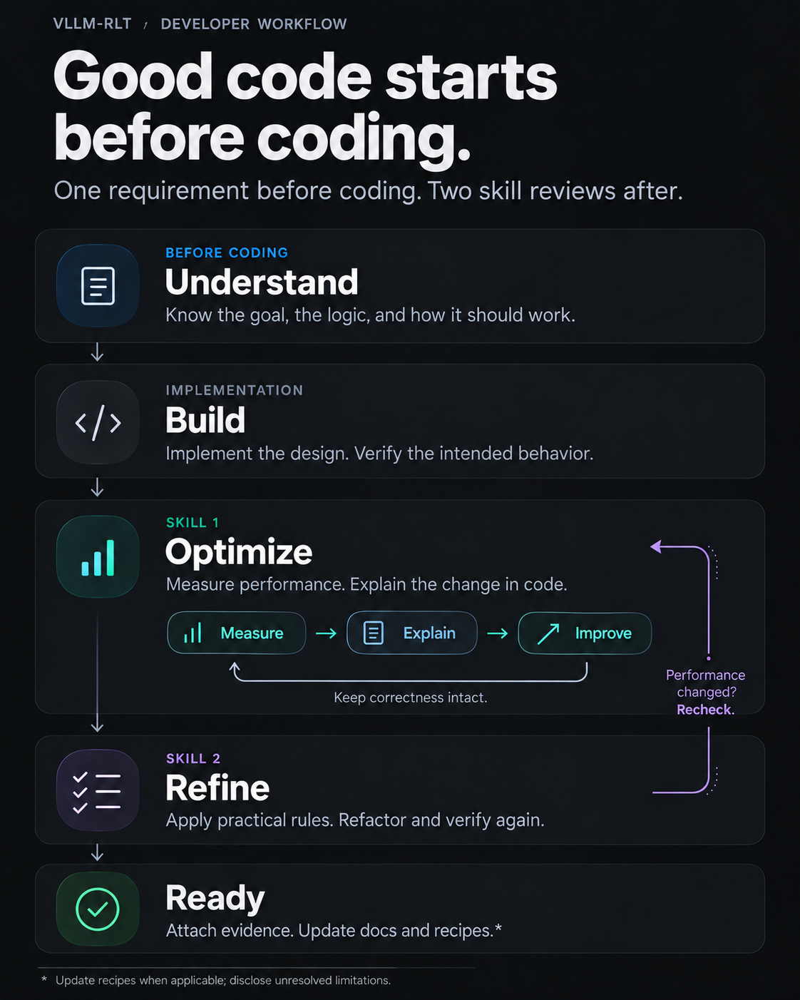

# Developer Must-Read: Development Workflow and Completion Criteria

Every change should begin with a clear understanding of its purpose and end with evidence of correct behavior, understood performance, and maintainable code. These requirements apply regardless of the tools or implementation methods used. Working code and passing tests are necessary evidence, but do not establish completion on their own.

The workflow has **one requirement before implementation and two required skill-based reviews afterward**:

1. Understand the requirement, its principles, and the execution flow before coding.
2. Analyze and optimize the implementation’s performance.
3. Review and refactor the code against a maintained set of concrete engineering rules.

After implementation, verify that the actual behavior matches the original requirement before proceeding with optimization.

## 1. Before Implementation: Understand What You Are Building

Before implementing a change, be able to explain:

- **The requirement:** What specific problem does the change solve, and what behavior is expected?
- **Its purpose:** Which part of the engine changes, what should improve, and what costs might be introduced?
- **The principle:** Why should the proposed approach work, and under what assumptions?
- **The computation and code logic:** What are the main inputs, operations, state transitions, and outputs?
- **The execution flow:** Which modules participate, how does data move between them, and how does the change interact with existing features?
- **The validation criteria:** What would demonstrate correct behavior and establish whether the change achieves its goal?

You do not need to know every implementation detail in advance. You do need enough understanding to evaluate the design, recognize incorrect assumptions, and review the implementation.

For looped Transformers, changes involving recurrence, early exit, KV caches, or hidden states require understanding how those states are produced, consumed, retained, and released across loop depths.

Read existing project code and relevant implementations, including vLLM where applicable. Identify what can be reused and what needs adjustment for recurrent execution. Similar names or interfaces do not establish equivalent behavior.

Record this understanding briefly in the issue, RFC, or PR. Reuse existing discussion rather than creating duplicate documents. Resolve fundamental uncertainties before beginning implementation.

## 2. After Implementation: Verify the Intended Behavior

Before optimizing or refactoring, compare the implementation with the original requirement:

- Does it implement the intended behavior, beyond exposing an option or passing a demonstration case?
- Does it preserve the required request semantics, numerical behavior, exit policy, and state lifecycle?
- Do relevant feature combinations still work? Are limitations and fallback paths explicit?
- Does validation cover the important boundaries and failure cases?

If implementation and intent differ, correct the implementation or explicitly revise the requirement. A performance improvement does not compensate for missing functionality. Shorter outputs, fewer loops, or relaxed precision requirements must not be presented as equivalent-work speedups.

## 3. First Post-Implementation Skill: Performance Analysis and Optimization

Use the [rlt-perf-opt skill](../.agents/skills/rlt-perf-opt/SKILL.md) to evaluate the change. The required workflow is summarized below.

The goal goes beyond establishing that an implementation is faster or slower. Explain **where the change occurs in the code or execution flow, what work or waiting it removes, what overhead it introduces, and how these changes account for the measured result**.

### Establish the Workload and Comparison

Choose a dataset or benchmark scenario that exercises the problem the feature is intended to solve. Fix the model, hardware, inputs, output-length policy, concurrency or arrival process, exit policy, backend, and relevant execution settings.

When historical results exist, reproduce or reconcile their configuration first. Changing input distributions, output lengths, P/D ratios, loop policies, or cache settings creates a different experiment. Results from that experiment cannot, by themselves, establish a regression against the original result.

State whether the comparison isolates one feature or compares separately tuned deployment configurations. Account for hardware resources and explain configuration differences that cannot be aligned.

### Separate Performance Measurement from Profiling

**Measure real throughput and latency with profiling disabled.** Warm up the relevant execution paths, repeat measurements, and retain the raw results, variability, and failed requests.

Then collect two independent diagnostic profiles for a representative workload:

| Mode | Operator activity | Shapes | Memory | Stacks |
| --- | --- | --- | --- | --- |
| ops-only | Enabled | Disabled | Disabled | Disabled |
| full | Enabled | Enabled | Enabled | Enabled |

Both modes should include CPU and supported device activity. Use ops-only to inspect operators, launches, copies, synchronization, and the device timeline. Use full to investigate tensor shapes, memory behavior, and source call stacks.

Do not report profiled latency as a production performance result. Do not interpret the additional overhead of full profiling as an engine regression. Follow the skill for capture configuration, metric definitions, and artifact checks.

### Explain Results at the Code and Execution Level

Build an evidence chain:

**Change → code or execution-flow difference → change in work or waiting → measured performance difference.**

For example, a PD analysis should go beyond saying that disaggregation reduces prefill interference. Identify where interference occurred, which work no longer blocks decode, how much output timing improves, and whether admission queues, KV handoff, or time to first token become more expensive.

Distinguish measurements from interpretations:

- CPU synchronization time may include waiting for previously submitted GPU work. It is not necessarily data-transfer overhead.
- Overlapping operators or work on different devices cannot simply be added together as end-to-end latency.
- Average latency, tail latency, total throughput, and latency-qualified goodput may move in different directions.
- If the available evidence does not isolate a cause, label it as a hypothesis and validate it with a controlled comparison or ablation.

Give absolute changes and relative differences where meaningful, linked to source locations and profiling evidence. Do not invent a complete numerical breakdown when the measurements cannot support one.

### Optimize and Explain the Stopping Point

Prioritize opportunities supported by evidence, especially those affecting the critical path. After each change, recheck behavior, correctness, and performance under the same measurement conditions.

Not every PR must improve throughput. A change may reasonably trade some performance for maintainability, functionality, or better tail latency. Quantify that tradeoff and explain why it is appropriate.

Before calling optimization complete, show that the main bottlenecks have been examined and that reasonable candidates have been tested or ruled out with evidence. Describe the result as the best tested configuration or the most suitable tested tradeoff for the target hardware and workload. A single benchmark does not establish a global optimum, and completion does not require an unlimited search.

Once correctness and performance results are stable, preserve the reusable configuration and reproduction steps. Update an existing recipe in the repository’s format. If recipes are not yet established, retain the material for later publication.

### Required Performance Evidence

Include a concise PR summary with links to:

- Environment, code and model versions, workload, and comparison configurations.
- Unprofiled performance results and correctness or task-quality results.
- Ops-only and full artifacts, relevant source locations, and a quantitative explanation.
- Optimizations completed, accepted tradeoffs, applicable scope, and unresolved issues.
- Commands to start the engine, reproduce a request, and run the benchmark.

Scale validation to the change. For changes that do not affect execution, such as documentation edits, explain why runtime performance analysis is not applicable rather than running irrelevant GPU benchmarks.

## 4. Second Post-Implementation Skill: Code Quality and Refactoring

After the implementation and performance work stabilize, review the change with the [rlt-refactor skill](../.agents/skills/rlt-refactor/SKILL.md).

This skill should use a **maintained library of concrete engineering rules**, derived primarily from actual development, code reviews, and debugging experience. Refactoring decisions should address concrete engineering problems rather than arbitrary stylistic preferences.

### Maintain Specific, Evidence-Based Rules

Each rule should describe its applicability, the problem it prevents, the preferred approach, and reasonable exceptions. Include examples or references when useful.

The rule library can develop around these areas:

| Area | Review questions |
| --- | --- |
| Responsibilities and state ownership | Are scheduling, computation, KV management, and output handling clearly separated? Is the same state maintained independently in multiple places? |
| Capability selection | Are execution paths selected using actual hardware and backend capabilities? Does the code rely on unexplained numbers, strings, or indirect assumptions? |
| Shared logic and special cases | Can common computation be shared while state handling remains explicit? Are special-case branches scattered across modules? |
| Interfaces and abstractions | Does an interface express a real need? Does a single use case introduce unnecessary layers or an oversized framework? |
| Lifecycle and error handling | Are allocation, submission, rollback, and release consistent? Does cancellation or failure leave valid state? |
| Configuration and readability | Are parameter meanings, defaults, and fallbacks clear? Do names and comments explain behavior and necessary constraints? |

These are organizing areas for the rule library, not automatic reasons to rewrite every matching piece of code. A rule should address a real problem. An observation that applies in a narrow context should not become a universal prohibition.

### Refactor to Resolve Identified Problems

Review the changed code against applicable rules. For each finding, identify the location, rule, practical impact, and proposed correction.

Sharing logic should reduce duplication without obscuring dependencies. Separating state handling should make execution easier to follow without creating excessive indirection. Keep unrelated cleanup outside the change’s scope.

Revalidate behavior after refactoring. If a refactor touches an execution path, return to the performance skill to check for additional copies, synchronization, allocations, or scheduling overhead.

### Required Code-Quality Evidence

Summarize which rules applied, what was corrected, and why any recommendations were not adopted. Do not manufacture refactoring work to satisfy a checklist. Record that no applicable issue was found when that is the result.

Add reusable lessons to the rule library so subsequent reviews benefit from them.

## 5. Definition of Done

Before marking a PR ready for review, be able to answer:

- Do I understand the requirement, principles, computation, and execution flow?
- Does the implementation match the intended behavior, with limitations disclosed?
- Have performance changes been measured and explained at the code or execution level?
- Have worthwhile optimization candidates been evaluated, with remaining tradeoffs justified?
- Has the code been checked against applicable engineering rules and revalidated after refactoring?
- Have relevant documentation and the README been updated for new models, features, parameters, or usage changes?

List unfinished validation and unresolved blockers explicitly. Draft PRs are useful for discussion, but an unverified implementation should not be described as completed development.

## Development Skills

The [rlt-perf-opt skill](../.agents/skills/rlt-perf-opt/SKILL.md) covers reproducible benchmarks, ops-only/full profiling, source-level attribution, optimization, and correctness checks.

The [rlt-refactor skill](../.agents/skills/rlt-refactor/SKILL.md) provides concrete code-quality rules and examples. Its rule library will evolve with subsequent development and review experience.
