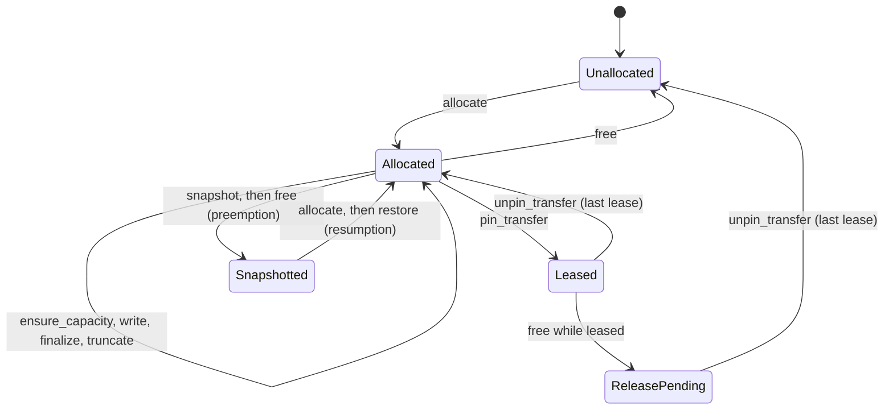

# KV Cache Manager Walkthrough

This is the first M4 increment of the [refactor RFC](https://github.com/ThinkFlowLab/vllm-rlt/issues/32). It explains how `KVCacheManager` works today, lists which modules read its private state, and adds public methods so they no longer have to. It uses the same layout as the [M3 increment](https://github.com/ThinkFlowLab/vllm-rlt/issues/32#issuecomment-5749081221); section 9 goes through the M3 checklist.

Files in scope:

- [kv_cache_manager.py](../vllm_rlt/core/kv_cache_manager.py): the page pool, per-request allocations, written-position state, prefix cache, transfer leases, per-traversal metadata, KV writes, attention dispatch, and early-exit finalization.
- Callers changed here: [scheduler.py](../vllm_rlt/core/scheduler.py), [preemption.py](../vllm_rlt/engine/preemption.py), [pd/worker.py](../vllm_rlt/pd/worker.py), [model_runner.py](../vllm_rlt/worker/model_runner.py).

## Why the manager looks the way it does

A recurrent model runs the same transformer core several times per token. In the LAST_EXITED layout each loop depth keeps its own KV for every position, so a query at depth `d` reads history computed at depth `d`. When a token exits early it never computes the deeper depths. Its last computed depth is copied into the skipped planes, so later tokens can attend at any depth without hitting a hole. SHARED keeps a single plane and overwrites it on every loop.

So the manager has to track three things per request:

1. Which physical pages back each `(plane, logical page)`.
2. Which `(plane, layer, position)` slots already hold valid KV.
3. Who else still needs the pages alive: prefix cache entries and in-flight PD transfers.

Everything else in the file is device work that happens to live next to that state: building address tensors, writing K/V, calling attention, copying pages for preemption.

```text
allocate / ensure_capacity / free      pages and reference counts
publish_prefix / lookup_prefix          prefix reuse
pin_transfer / unpin_transfer           leases for PD transfers
_prepare_batch                          address tensors for one traversal
_write_prepared / _attend_prepared      KV writes and attention
finalize_token                          early-exit copies plus bookkeeping
truncate_suffix                         rollback for speculative decoding
```

An allocation moves through these states:



Pages freed by `free` stay referenced as long as a prefix entry points at them. `_claim` evicts entries oldest first, and only when eviction is enough to satisfy the claim.

## 1. Baseline and boundary

Baseline: upstream `main` at `3314c1b`, which already contains the synchronous speculative decoding from [#44](https://github.com/ThinkFlowLab/vllm-rlt/pull/44). References below name functions, not line numbers.

Who calls `KVCacheManager` at the baseline, and what they reach into:

| Caller | Module | Public methods used | Private state used |
| --- | --- | --- | --- |
| `Scheduler` | M3 | `lookup_prefix`, `required_blocks`, `allocate`, `ensure_capacity`, `free`, `num_free_blocks`, `watermark_blocks`, config attributes | `_refs` to price a prefix hit. `_get_allocation(...).block_tables[0]` to count held pages |
| `PreemptionManager` | M3 | `allocate`, `free`, `poll_prefixes`, `required_blocks`, `block_size`, `dtype`, `device` | `_get_allocation(...).transfer_leases`. Raw `key_cache[block]` copies. Writes `allocation.written` on resume |
| `PDWorker` | M9 | `allocate`, `free`, `pin_transfer`, `unpin_transfer`, `lookup_prefix`, `publish_prefix`, `poll_prefixes`, `mark_imported_prefix`, `num_used_blocks` | `_allocations` membership. `_get_allocation(...).block_tables` for transfer plans |
| `NixlConnector` | M9 | `key_cache`, `value_cache`, geometry attributes | None, but it registers the storage tensors directly |
| `ModelRunner` | M5 | `finalize_token`, `layout`, `attention`, `key_cache`, `value_cache`, geometry attributes | `_prepare_batch`. Reads and writes `_get_allocation(...).written` in `finalize_many` |
| `DecodeWorkspace`, `AsyncState`, `PrefillMetadataBank` | M5 | geometry attributes, `device` | `_validate_rows`, `_plane`, `_allocations`, `_get_allocation`. Build `_PreparedKVBatch` themselves |
| `RecurrentGraphs` | M5 | `attention`, `key_cache`, `value_cache` | `_require_live_batch`, `_require_prefix`. Updates `written` after graph replay |
| `SpeculativeRunner` (#44) | M5, RFC #43 | `truncate_suffix` via the engine, `attention` capability | `_prepare_batch` for draft and verification batches |
| `Ouro` model | M6 | None | `_prepare_batch`, `_write_prepared`, `_attend_prepared` |
| `LLMEngine` | M2 | construction, `publish_prefix`, `poll_prefixes`, `truncate_suffix`, `attention` capability checks | None |
| Serving worker, `PDEngine` | M1, M9 | `num_used_blocks` for statistics | None |

None of the private uses is a known bug. They are dependencies that break whenever the internal layout changes. This increment removes the M3 and M9 rows and the `written` handling in `ModelRunner`. The M5 and M6 rows stay for the next increment, because they share one root cause: there is no public way to build a prepared batch.

## 2. Classes and state

| Field | What it holds | Who writes it | Lives for |
| --- | --- | --- | --- |
| `key_cache`, `value_cache` | `[block, layer, token, kv_head, dim]` device storage for all planes | `_write_prepared`, `finalize_token`, `restore`, the finalize kernel, NIXL | Engine lifetime |
| `_free_blocks` | Stack of blocks with no references | `_claim`, `_drop_refs` | Engine lifetime |
| `_refs[block]` | Reference count: one per owning request plus one per prefix entry | `_claim`, `_drop_refs`, `allocate`, `publish_prefix` | Engine lifetime |
| `_allocations[request_id]` | One `_Allocation` per admitted request | `allocate`, `free` | Admission to release |
| `_prefixes` | LRU map from prompt-page digest to one block per plane | `publish_prefix`, `lookup_prefix` (order), `_claim` (eviction) | Until evicted |
| `_pending_prefixes` | Publications waiting for a device event | `publish_prefix`, `poll_prefixes` | Until the event fires or the allocation changes |
| `_Allocation.max_tokens` | Logical capacity in tokens. Never grows | `allocate` | Allocation |
| `_Allocation.block_tables` | Per plane: physical block for each logical page | `allocate`, `ensure_capacity` | Allocation |
| `_Allocation.written[plane][layer]` | `_WrittenPositions`: a contiguous prefix plus a set of pending out-of-order positions | `allocate` (prefix length), `_write_prepared`, `finalize_token`, `mark_finalized`, `mark_imported_prefix`, `truncate_suffix`, `restore`, `RecurrentGraphs` (still direct) | Allocation |
| `_Allocation.transfer_leases` | Transfer ids that must finish before release | `pin_transfer`, `unpin_transfer` | Allocation |
| `_Allocation.release_requested` | `free` was called while a lease was held | `free` | Until the last lease ends |
| `_PreparedKVBatch` | Borrowed metadata for one traversal: rows, allocation identities, device address tensors | `_prepare_batch` and the M5 builders | One traversal. `_require_live_batch` rejects stale ones |
| `KVSnapshot` (new) | Host copy of a request's pages and written state | `snapshot` | Preemption to resumption |

`storage_depths` is `max_loops` for LAST_EXITED and 1 for SHARED. `_plane(depth)` maps a loop depth to a plane index. Inside the manager every block-table and written-state access goes through it, so SHARED never touches a second plane.

`_WrittenPositions` looks more complex than needed, but it is not. Packed prefill on FlashAttention-4 writes a whole chunk in one launch, and the asynchronous banks can report layers out of order. The state has to accept sparse writes and only expose the contiguous prefix.

## 3. Function contracts

Tensor arguments to `write`, `attend`, and the prepared variants are `[batch, heads, head_dim]` on the cache device and dtype. Depths and layers start at 0. Positions are token indices inside one request.

| Method | Expects | Does |
| --- | --- | --- |
| `required_blocks(max_tokens)` | A positive token count | Returns the blocks needed for that capacity across all planes. Pure |
| `allocate(request_id, max_tokens, *, initial_tokens, prefix)` | An unused id, a frontier within capacity, a prefix from `lookup_prefix` | Returns `False` and changes nothing if the pool cannot back the frontier. Otherwise references the prefix blocks and claims fresh ones in one step, evicting prefix entries only if that makes the claim fit |
| `ensure_capacity(request_id, tokens)` | A frontier within `max_tokens` | Returns `False` and changes nothing if the growth pages are not available even after eviction. Otherwise grows every plane in one step |
| `truncate_suffix(request_id, frontier)` (#44) | No lease, a frontier within capacity, no shared prefix page at or past the frontier | Lowers the written prefix of every plane and layer to `frontier`. Pages stay reserved. Stale bytes are hidden by the context lengths |
| `free(request_id)` | Any id | Drops references. If a lease is held, release waits for the last `unpin_transfer`. Unknown ids are ignored |
| `pin_transfer` / `unpin_transfer` | An allocated id and a transfer id | Lease bookkeeping. `pin_transfer` refuses an allocation that is already scheduled for release |
| `publish_prefix(request_id, tokens, length, event)` | The prefilled length, the full prompt, an optional device event | Indexes complete pages whose every plane and layer has a contiguous written prefix. Waits for the event first if one is given |
| `lookup_prefix(tokens)` | Prompt tokens | Returns one group per cached page, each holding that page's block in every plane, for the longest cached run. The last prompt token is never included. Refreshes LRU order and polls pending publications |
| `mark_imported_prefix(request_id, length, *, start)` | A length the connector has confirmed | Sets the written prefix on every plane and layer. Refuses cancelled or already-initialized allocations |
| `has_allocation(request_id)` (new) | Any id | Membership. Pure |
| `allocated_blocks(request_id)` (new) | An allocated id | Blocks held across all planes. Pure |
| `plane_block_tables(request_id)` (new) | An allocated id | One block table per plane. Indexed by plane, unlike `get_block_table`, which takes a depth. Pure |
| `has_transfer_lease(request_id)` (new) | An allocated id | Whether release must wait for a transfer. Pure |
| `exclusive_prefix_blocks(prefix)` (new) | A result of `lookup_prefix` | Blocks held only by the prefix cache. This is what admission must budget to make them non-evictable. Pure |
| `token_written(request_id, position, depth)` (new) | An allocated id, a valid position and depth | Whether every layer holds KV for that position at that plane. Pure |
| `mark_finalized(request_id, position, exit_depth)` (new) | Every layer written at `exit_depth` | Marks the position written at every deeper plane. Copies nothing. Does nothing for SHARED |
| `finalize_token(request_id, position, exit_depth)` | Same | Copies the exit-depth K/V into the deeper planes on the current stream, then does what `mark_finalized` does |
| `snapshot(request_id)` (new) | No lease, device work finished | Returns a `KVSnapshot`: host pages in block-table order plus an independent copy of the written state |
| `restore(request_id, snapshot)` (new) | A fresh allocation with the same capacity and page count | Copies the pages back on the current stream and installs the written state |
| `_prepare_batch(request_ids, depths, positions, *, for_write, packed_prefill)` | Equal-length rows, unique addresses for writes | Builds a `_PreparedKVBatch` with device tensors. Does host-to-device copies |
| `_write_prepared` / `_attend_prepared` | A live batch from this manager | Writes update the written state. Attention requires a contiguous written prefix up to each row's position |

`num_free_blocks` counts unreferenced blocks plus blocks held only by prefix entries, because `_claim` can evict the latter. `num_used_blocks` is the rest.

## 4. Call chains

### 4.1 Admission and growth

```text
Scheduler._plan_admission
    lookup_prefix → exclusive_prefix_blocks → required_blocks → AdmissionPlan
Scheduler._commit_admission
    num_free_blocks check → allocate(prefix=...) → Stage.PREFILL
Scheduler._ensure_execution_capacity
    ensure_capacity → on failure: preempt, then retry
Scheduler._reserved_growth_blocks
    allocated_blocks → required_blocks
```

`allocate` references the prefix blocks before it claims fresh ones, so an eviction inside `_claim` cannot free them. If the claim fails it drops those references again. `ensure_capacity` claims the growth pages for all planes in one `_claim` call, so a plane can never grow on its own.

### 4.2 One recurrent traversal

```text
ModelRunner._execute / Ouro.recurrent
    _prepare_batch → for each layer: _write_prepared, _attend_prepared
ModelRunner.finalize / finalize_many
    token_written → copies (finalize_token or the finalize kernel) → written-state update
SpeculativeRunner.execute (#44)
    _prepare_batch (draft rows, then verification rows) → engine commits tokens
    → truncate_suffix(frontier = committed positions)
```

`_require_live_batch` compares the allocation objects captured at prepare time with the current `_allocations` map. A batch built before a request was freed and readmitted under the same id is rejected. `_require_prefix` makes sure attention never reads a position that has not been written at that plane and layer. That includes positions an early exit skipped, until `mark_finalized` records them.

### 4.3 Prefix reuse

```text
prefill completes → publish_prefix(event) → _pending_prefixes
next lookup_prefix → poll_prefixes → publish once the event has fired
admission → lookup_prefix → allocate(prefix) → _refs += 1 per block
pressure → _claim → evict oldest entries → _drop_refs
```

Each entry holds one reference per block. A block shared by a cached entry and one live request therefore has two references. `exclusive_prefix_blocks` counts the blocks with exactly one.

### 4.4 Preemption

```text
PreemptionManager.preempt
    has_transfer_lease → model_runner.synchronize → snapshot → model_runner.release
    → poll_prefixes → free → Stage.WAITING
PreemptionManager.resume
    allocate(initial_tokens=frontier) → restore → stream synchronize → enqueue
```

The snapshot holds every plane, so resumption reproduces the exit trajectory exactly instead of recomputing at full depth. The hidden state and the pending input token stay on the request, outside M4.

### 4.5 Disaggregated prefill

```text
decode worker: allocate → pin_transfer → send block tables to the prefill worker
prefill worker: chunks written → NIXL writes into the decode pages
decode worker: mark_imported_prefix → publish_prefix → unpin_transfer
cancellation: free (waits while leased) → unpin_transfer → release
```

`mark_imported_prefix` is the only path that marks positions written because a remote worker said so. It trusts the connector's completion notification instead of a local `_write_prepared`.

## 5. Findings

Classes used below. **Structural**: a boundary problem this refactor fixes or schedules. **Behavioral**: a runtime effect that needs its own explicit fix. **Open question**: needs a decision. **Necessary**: complexity that should stay.

| ID | Where | Class | What happens | Outcome |
| --- | --- | --- | --- | --- |
| F1 | `Scheduler._plan_admission`, `_reserved_growth_blocks` | Structural | Admission pricing depends on how reference counts and block tables are stored. Changing either silently changes admission | Replaced by `exclusive_prefix_blocks` and `allocated_blocks` |
| F2 | `PreemptionManager.preempt`, `resume` | Structural | Preemption copied pages by raw block id and wrote `allocation.written` directly, skipping every check the manager does elsewhere | Replaced by `snapshot` and `restore`, which check capacity, page count, leases, and that the target is empty |
| F3 | `PDWorker.remove`, `accept`, `queue_chunk` | Structural | Membership test on `_allocations`; block tables through `_get_allocation` | Replaced by `has_allocation` and `plane_block_tables` |
| F4 | `ModelRunner.finalize_many` | Structural | The async finalize path had its own copy of the written-state check and update, and indexed planes by depth without `_plane` | Replaced by `token_written` and `mark_finalized`. `finalize_token` now shares the same bookkeeping |
| F5 | `DecodeWorkspace.prepare`, `AsyncState.prepare`, `PrefillMetadataBank`, `RecurrentGraphs`, `Ouro` | Structural | Four builders construct `_PreparedKVBatch` from `_Allocation` internals so they can control pinned buffers and streams. The model and the graph runner call private write, attend, and validation methods, and update `written` after replay | Next increment: a public prepared-batch contract that separates host address computation from device tensors |
| F6 | `_claim`, via `allocate` and `ensure_capacity` | Behavioral, confirmed by test | See below | Fixed here. See below |
| F7 | `_prepare_batch` | Structural | Builds five device tensors per call, six for packed prefill, each with a synchronous host-to-device copy. M5 duplicated the builder to pin and reuse buffers | Same as F5 |
| F8 | `truncate_suffix` (#44) | Open question | Truncation lowers the written prefix without any device completion evidence. That is fine for the synchronous round, which calls it after `SpeculativeRunner.execute` returns. It is not enough for the asynchronous path in RFC #43. `SpeculativeRunner` also uses the private `_prepare_batch` | When async speculation lands, add a completion-evidence argument to `truncate_suffix` rather than a second rollback mechanism |
| F9 | `_WrittenPositions` | Necessary | Packed prefill and async banks write out of order | Keep. Explained in section 2 |
| F10 | `free` while leased | Necessary | Release waits for the last `unpin_transfer`. `num_free_blocks` correctly excludes those pages meanwhile | Keep. `snapshot` refuses leased allocations for the same reason |
| F11 | Async eager decode, measured | Performance | See below | Not an M4 change. See below |

**F6 in detail.** `_claim` evicted prefix entries one at a time until enough blocks were free, and could still fail. The evictions were not undone. `Scheduler._commit_admission` checks `num_free_blocks` first, but `Scheduler._ensure_execution_capacity`, `PreemptionManager.resume`, and `PDWorker.accept` call `ensure_capacity` or `allocate` without that check. So a failed growth, resumption, or PD reservation threw away reusable prefixes and got nothing for it. The fix: `_claim` returns `None` before touching the prefix index when `num_free_blocks < count`. That count already includes every block an eviction could release, so a claim that succeeds evicts exactly as before. `test_failed_claim_leaves_prefix_entries_in_place` fails on the old code.

**F11 in detail.** Measured on one RTX PRO 6000 with Ouro-1.4B BF16, Triton attention, 64 requests, 256-token prompts, 128 outputs, `ouro_delayed` at 0.5, async scheduling with static buffers. Over 80 engine steps the GPU was busy 32% of the wall time. There were 184k kernels averaging 8 µs, 2.0M CPU-side ATen ops, and 159k launches. The CPU spent about 57 ms per step; the GPU needed about 19 ms. Sampled Python self time: `models/ouro.py` 36% (RMSNorm, rotary, and per-layer projections, none fused), `torch` 19%, `kv_cache_manager.py` 13% (per-layer `_write_prepared` indexing and written-state updates), `worker/buffers.py` 8%. `aten::select` and `aten::copy_` were called about 300k times, mostly from the per-request hidden-state save and gather loops in `ModelRunner`. CUDA graphs already recover most of this: 762 to 968 tok/s in the same setup. One M4-side idea was tried and rejected: replacing the two per-layer advanced-index KV writes with a flat `index_copy_` gave no measurable gain in synchronous mode and does not work with static descriptors that are updated in place. The rest of the host cost belongs to M5 (batch the per-request hidden-state copies) and M6 (fuse RMSNorm and rotary).

## 6. What this increment changes

| Area | Change |
| --- | --- |
| Allocation views | `has_allocation`, `allocated_blocks`, `plane_block_tables`, `has_transfer_lease`, `exclusive_prefix_blocks` |
| Written state | `token_written` and `mark_finalized`. `finalize_token` and `mark_finalized` share one precondition check and one bookkeeping helper |
| Preemption | `KVSnapshot`, `snapshot`, `restore`. `PreemptionManager` no longer touches pages or `_Allocation` |
| PD | `PDWorker` uses `has_allocation` and `plane_block_tables` |
| Scheduler | `exclusive_prefix_blocks` and `allocated_blocks` replace `_refs` and `_get_allocation` |
| Behavioral fix | `_claim` no longer evicts prefix entries for a claim that cannot succeed (F6) |

The F6 fix is the only intended behavior change. Successful claims, admission budgets, KV layouts, exit semantics, and transfer behavior are all unchanged.

Three checks are stricter than before. None of them can fire through an existing caller:

- `restore` refuses a capacity or page-count mismatch, and a target that already holds KV. `PreemptionManager.resume` allocates exactly the snapshot's capacity and frontier, without a prefix, right before restoring, so neither can happen.
- `snapshot` refuses leased allocations. `_is_preemption_candidate` already filters those out.
- `token_written` validates the depth. `finalize_many` would now raise on a request with no completed loop instead of silently indexing the last plane.

`restore` also copies the snapshot's written state instead of aliasing it, so a snapshot could be restored twice. `PreemptionManager` still discards it after one use.

### Migrating callers

Code under `vllm_rlt/` that reads `cache._refs`, `cache._get_allocation(...)`, or `cache._allocations` should use the views above. The M5 builders and the model listed under F5 still use private state; they change in the next increment. Tests that check reference counts or written state on purpose keep doing so. The two tests that only needed block tables now call `plane_block_tables`.

## 7. Where this is going

The RFC splits the manager's job across three owners:

| Owner | Responsibility | State |
| --- | --- | --- |
| M4, logical KV | Capacity, pages, references, prefix index, leases, written positions, rollback | `_free_blocks`, `_refs`, `_allocations`, `_prefixes`, `written` |
| M5, device storage | Storage tensors, building device tensors for a batch, pinned buffers, streams and events, page copies for finalize and preemption | `key_cache`, `value_cache`, prepared batches, snapshots |
| M8, attention | Backend selection and capabilities, attention metadata, kernel dispatch | `attention`, `attention_info`, packed-prefill rules |

Planned increments:

1. **This one.** Public views replace the private reads from M3 and M9. Written-state bookkeeping has one implementation.
2. **Prepared-batch contract.** M4 exposes the host-side row data (plane, block, offset, context length, allocation identity) as plain data. M5 owns the one builder that turns it into device tensors, pinned or not. `_PreparedKVBatch` becomes public. `Ouro` and `RecurrentGraphs` call public write and attend methods. This closes F5 and F7.
3. **Storage split.** `key_cache` and `value_cache` move behind an M5 storage object that M4 no longer references. `snapshot`, `restore`, and the finalize copies move with them. M4 keeps the written-state update. NIXL registers the storage object instead of manager attributes.
4. **Attention handoff.** Backend selection and the packed-prefill rules move to M8 together with the metadata they interpret. [#46](https://github.com/ThinkFlowLab/vllm-rlt/pull/46) already pulls backend selection and the page-table, context-length, and packed-query builder out of `_prepare_batch`. Step 2 defines the row data that builder consumes, so the two go together.
5. **Rollback contract.** Give `truncate_suffix` a completion-evidence argument so synchronous and asynchronous speculation share one interface that also respects leases (F8).

Each step keeps the old entry points as adapters until every caller has moved, then removes them.

## 8. Validation

New CPU tests in [test_kv_cache.py](../tests/test_kv_cache.py):

- The views report membership, held pages under incremental growth, per-plane tables, and lease state. SHARED exposes one plane, and depth-indexed access still works for every depth.
- `exclusive_prefix_blocks` counts only the blocks the prefix cache holds, before and after a live request claims them, including a partially claimed prefix.
- `token_written` requires every layer. `mark_finalized` marks deeper planes without touching their bytes, refuses unwritten tokens, records nothing new at the deepest loop, and leaves SHARED state unchanged.
- `snapshot` and `restore` round-trip pages and written state through a disturbed pool in both layouts, refuse capacity and page-count mismatches, refuse a non-empty target, and do not alias the live allocation.
- `snapshot` refuses leased allocations.
- A claim that cannot succeed leaves prefix entries and free-block accounting untouched. A later claim that can succeed still evicts (F6).

Existing tests in `test_prefix_growth.py` (preemption, resumption, prefix pricing), `test_pd.py`, `test_async_pipeline.py`, `test_engine.py`, and `test_cdb_runtime.py` cover the migrated callers. Counts are in the pull request.

GPU, one RTX PRO 6000 Blackwell, torch 2.13+cu129, Triton 3.7.1, no FlashAttention or NIXL installed. `pytest --run-gpu -m gpu` gives 71 passed and the same 30 failures on `main` and on this branch. Every failure is a missing FlashAttention, FA4, or NIXL backend. Ouro-1.4B BF16 runs with 64 requests, 256-token prompts, and 128 outputs, alternating `main` and this branch for three or more trials, produce identical token ids and exit depths in all seven configurations tried. That includes preemption under KV pressure with prefix caching, and the async finalize path with early exits. Throughput differences stay inside the trial spread, between -3% and +5%. FA4, packed prefill, and PD transfer were not verified.

## 9. The M3 checklist applied to M4

| Category | Done here | Still open |
| --- | --- | --- |
| Responsibility separation | Written-state bookkeeping has one implementation, shared by the sync copy path and the async kernel path | Storage tensors, batch building, and attention dispatch still live in the manager (steps 2 to 4) |
| State ownership | `PreemptionManager` no longer writes `written` or reads pages by block id. `Scheduler` no longer reads reference counts | M5 builders still read `_allocations` and build `_PreparedKVBatch` (F5) |
| Type safety | `KVSnapshot` replaces an untyped dict of tensors and lists | `layout` and `backend` are still strings. An enum makes sense once M8 owns backend names |
| Named data contracts | `KVSnapshot`. The views return plain facts, not `_Allocation` | Host-side row data for step 2 |
| Function interfaces | `plane_block_tables` says it is indexed by plane, unlike `get_block_table`. `exclusive_prefix_blocks` is typed and says what it counts | `publish_prefix(request_id, tokens, length)` takes `length` positionally, and it is the prefilled length, not `len(tokens)` |
| Control flow | `_claim` checks its precondition first instead of finding out after it has already evicted | `_prepare_batch` mixes host address computation with device tensors (F7) |
| Decision vs. mechanism | `allocate` (may fail) stays separate from `restore` (never fails once allocated) | The finalize copy and the finalize bookkeeping are only split on the async path |
| Unified cleanup | `free` is the single release path, delayed by leases | Nothing further |
| Naming and units | Block counts are physical blocks across planes. Token frontiers are exclusive counts | `pages` in `KVSnapshot` counts logical pages per plane and says so |
| Documentation | This note: lifecycle diagram, call chains, findings with evidence | Update as steps 2 to 5 land |
| Regression tests | Views, written state, snapshot round trips in both layouts, F6 | GPU-only paths (async finalize, CUDA graphs, NIXL) are not covered on CPU |
| Explicit behavioral fixes | F6 is fixed, tested, and listed apart from the structural changes | F8 waits for the async speculation increment |
