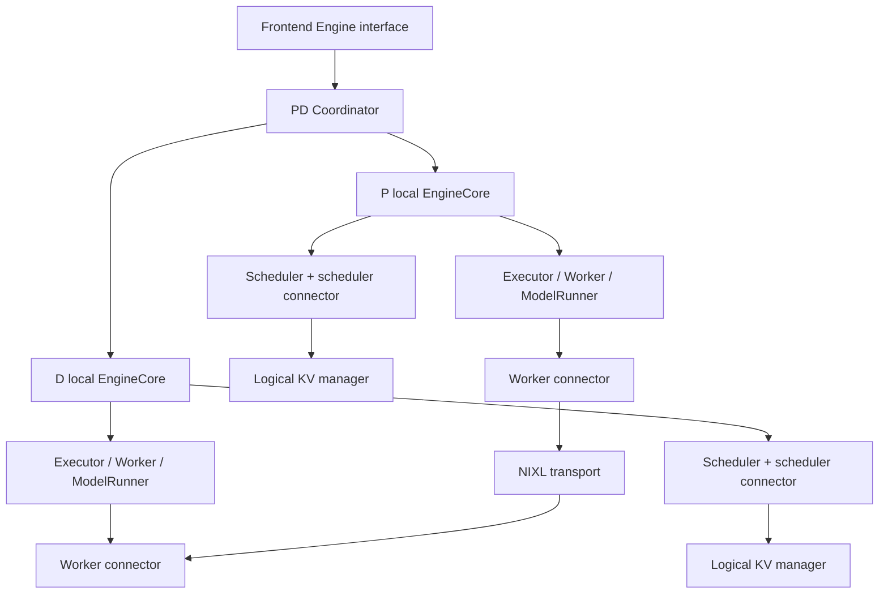

# PD and KV transfer refactoring

**Status: initial design draft, pending cross-module contract review.**

This document covers M9 in [architecture RFC #32](https://github.com/ThinkFlowLab/vllm-rlt/issues/32), including R0 contract design and R4 connector integration. Proposed interfaces and file names are discussion points, not accepted or implemented contracts in other modules.

## Baseline and scope

The baseline is commit `3314c1b37ea737cd1cb8188eec4ba6d09d785162`, titled `Merge pull request #44 from ThinkFlowLab/feat/fixed-loop-self-speculative-decoding`. All line references refer to this commit. Implementation PRs must pin their own baseline and reconcile changes before reusing these references.

This initial inspection does not replace the complete function and branch walkthrough required by RFC #32. Tests, GPU integration checks, and performance benchmarks have not been run for this draft. No new correctness defect is claimed.

| Boundary | Baseline location | Responsibility |
| --- | --- | --- |
| M9 | [pd/config.py:5–45](https://github.com/ThinkFlowLab/vllm-rlt/blob/3314c1b37ea737cd1cb8188eec4ba6d09d785162/vllm_rlt/pd/config.py#L5-L45) | Device pools, capacity, transfer limits, and timeouts |
| M9 | [pd/engine.py:23–467](https://github.com/ThinkFlowLab/vllm-rlt/blob/3314c1b37ea737cd1cb8188eec4ba6d09d785162/vllm_rlt/pd/engine.py#L23-L467) | P/D selection, resource credits, routing, processes, and failures |
| M9 | [pd/worker.py:20–391](https://github.com/ThinkFlowLab/vllm-rlt/blob/3314c1b37ea737cd1cb8188eec4ba6d09d785162/vllm_rlt/pd/worker.py#L20-L391) | GPU ownership, local execution integration, and handoff lifecycle |
| M9 | [pd/transport.py:9–176](https://github.com/ThinkFlowLab/vllm-rlt/blob/3314c1b37ea737cd1cb8188eec4ba6d09d785162/vllm_rlt/pd/transport.py#L9-L176) | Descriptors, NIXL registration, WRITE, notifications, and cleanup |
| Entrypoint | [entrypoints/pd_serve.py:15–128](https://github.com/ThinkFlowLab/vllm-rlt/blob/3314c1b37ea737cd1cb8188eec4ba6d09d785162/vllm_rlt/entrypoints/pd_serve.py#L15-L128) | PD configuration and HTTP application assembly |
| M1/M2 | [serving/worker.py:113–176](https://github.com/ThinkFlowLab/vllm-rlt/blob/3314c1b37ea737cd1cb8188eec4ba6d09d785162/vllm_rlt/serving/worker.py#L113-L176) | Admission, cancellation, outputs, and shutdown |
| M3 | [core/scheduler.py:59–82](https://github.com/ThinkFlowLab/vllm-rlt/blob/3314c1b37ea737cd1cb8188eec4ba6d09d785162/vllm_rlt/core/scheduler.py#L59-L82), [core/scheduler.py:323–368](https://github.com/ThinkFlowLab/vllm-rlt/blob/3314c1b37ea737cd1cb8188eec4ba6d09d785162/vllm_rlt/core/scheduler.py#L323-L368) | Request state, queues, and batch selection |
| M4 | [core/kv_cache_manager.py:253–368](https://github.com/ThinkFlowLab/vllm-rlt/blob/3314c1b37ea737cd1cb8188eec4ba6d09d785162/vllm_rlt/core/kv_cache_manager.py#L253-L368) | Allocation, mappings, leases, imported validity, and release |
| M5 | [worker/model_runner.py:248–321](https://github.com/ThinkFlowLab/vllm-rlt/blob/3314c1b37ea737cd1cb8188eec4ba6d09d785162/vllm_rlt/worker/model_runner.py#L248-L321), [worker/model_runner.py:351–437](https://github.com/ThinkFlowLab/vllm-rlt/blob/3314c1b37ea737cd1cb8188eec4ba6d09d785162/vllm_rlt/worker/model_runner.py#L351-L437), [worker/model_runner.py:582–598](https://github.com/ThinkFlowLab/vllm-rlt/blob/3314c1b37ea737cd1cb8188eec4ba6d09d785162/vllm_rlt/worker/model_runner.py#L582-L598) | Prefill, device state/execution, and synchronization |
| Existing checks | `tests/test_pd.py` | Leases, descriptors, integration, cancellation, ID and prefix reuse |

Paths are relative to `vllm_rlt/`, except the test path. M9 uses local engine and execution interfaces and exposes a PD facade to the frontend. Model architecture, attention numerics, general exit policies, and general preemption algorithms remain with their owning modules.

## Goals and preserved behavior

Separate P/D coordination, scheduling-side handoff state, and device transfer lifecycles. Replace private-state mutation with explicit plans and completion feedback.

Preserve these behaviors:

- Multiple GPUs on one host, one owner process per GPU, complete model replicas, and independent KV pools.
- D reserves receiving resources before P computes. P produces prompt KV in chunks and uses the existing P-to-D NIXL WRITE path.
- Computation and transfer overlap under bounded backpressure. Do not postpone all transfers until the entire prompt completes.
- Handoff includes KV at every valid depth/position and the final hidden state of the last prompt token. D owns coda, first-token sampling, and subsequent sampling RNG consumption.
- Commit marks submission of all chunks. Activation also requires receive completion and local execution readiness.
- LAST_EXITED/SHARED semantics, prefix hits, incremental allocation, exit modes, and supported preemption combinations.
- Independent generations prevent late results from affecting a new request reusing an external ID.
- Receiving memory cannot be reused until remote writes have ended. Buffers, events, and NIXL handles retain explicit lifetimes.

This work does not expand deployment scale, model coverage, or parallelism. Abstractions cover existing operations and required backends. Behavioral fixes must document their triggers and validation separately from structural migration.

## Current structure and initial findings

Local serving uses `EngineWorker → LLMEngine`. PD serving uses `EngineWorker → PDEngine → PDWorker processes`. Each PDWorker contains an ordinary LLMEngine, Scheduler, KVCacheManager, and ModelRunner. P manually selects PREFILL batches; D calls its local `engine.step()` after import.

| Location and trigger | Current behavior and impact | Classification and direction |
| --- | --- | --- |
| [pd/worker.py:117–162](https://github.com/ThinkFlowLab/vllm-rlt/blob/3314c1b37ea737cd1cb8188eec4ba6d09d785162/vllm_rlt/pd/worker.py#L117-L162), reserve/prefill | `accept()` removes WAITING entries, mutates Request stage/progress, and reads private allocations | Design concern: admission through M3/M4 contracts |
| [pd/worker.py:232–275](https://github.com/ThinkFlowLab/vllm-rlt/blob/3314c1b37ea737cd1cb8188eec4ba6d09d785162/vllm_rlt/pd/worker.py#L232-L275), next P chunk | Replaces the PREFILL queue, calls `_take()`, updates progress, accesses hidden and core stream | Design concern: separate eligibility, execution tasks, and completion feedback |
| [pd/worker.py:279–343](https://github.com/ThinkFlowLab/vllm-rlt/blob/3314c1b37ea737cd1cb8188eec4ba6d09d785162/vllm_rlt/pd/worker.py#L279-L343), transfer polling | Combines notifications, KV validity, leases, hidden binding, and CODA activation | Design concern: separate device feedback from scheduling-side activation |
| [pd/worker.py:106–115](https://github.com/ThinkFlowLab/vllm-rlt/blob/3314c1b37ea737cd1cb8188eec4ba6d09d785162/vllm_rlt/pd/worker.py#L106-L115), removal | Inspects `_allocations` and manually coordinates runner/scheduler/cache cleanup | Design concern: explicit cancellation and deferred release |
| [pd/engine.py:93–97](https://github.com/ThinkFlowLab/vllm-rlt/blob/3314c1b37ea737cd1cb8188eec4ba6d09d785162/vllm_rlt/pd/engine.py#L93-L97), [serving/worker.py:113–176](https://github.com/ThinkFlowLab/vllm-rlt/blob/3314c1b37ea737cd1cb8188eec4ba6d09d785162/vllm_rlt/serving/worker.py#L113-L176) | Synthetic scheduler/cache objects satisfy frontend internal access | Cross-module concern: remove after public M1/M2 interfaces migrate |
| [pd/engine.py:276–383](https://github.com/ThinkFlowLab/vllm-rlt/blob/3314c1b37ea737cd1cb8188eec4ba6d09d785162/vllm_rlt/pd/engine.py#L276-L383), admission | Credits conservatively budget lifetime demand, unlike actual allocated blocks | Necessary distinction: name both metrics clearly; initially preserve accounting |
| [pd/worker.py:316–343](https://github.com/ThinkFlowLab/vllm-rlt/blob/3314c1b37ea737cd1cb8188eec4ba6d09d785162/vllm_rlt/pd/worker.py#L316-L343), activation | Commit and receive notifications jointly constrain activation | Necessary complexity: retain distinct submission/completion evidence |
| [pd/engine.py:426–461](https://github.com/ThinkFlowLab/vllm-rlt/blob/3314c1b37ea737cd1cb8188eec4ba6d09d785162/vllm_rlt/pd/engine.py#L426-L461), fatal failure | Terminates P before D | Necessary complexity: preserve writer-before-receiver termination |

These findings are design concerns and necessary lifecycle distinctions, not reproduced bug reports.

### Expected benefits and performance hypotheses

Explicit contracts should reduce the number of modules that must change when scheduler queues, KV allocation internals, or runner state evolve. Separating transfer feedback from logical transitions also makes cancellation and resource-release conditions easier to review and test independently of model execution.

Performance improvement is not established by this inspection. The first structural migration should preserve the existing device path, chunk overlap, and acceptable baseline performance. It does not reduce full model replicas or KV pool sizes by itself.

| Candidate constraint | Baseline evidence | Measurement needed |
| --- | --- | --- |
| Conservative admission credits | [pd/engine.py:328](https://github.com/ThinkFlowLab/vllm-rlt/blob/3314c1b37ea737cd1cb8188eec4ba6d09d785162/vllm_rlt/pd/engine.py#L328) budgets D prompt plus maximum output | Admission wait versus actual allocation, prefix reuse, and realized output lengths |
| Transfer posting cadence | [pd/worker.py:309](https://github.com/ThinkFlowLab/vllm-rlt/blob/3314c1b37ea737cd1cb8188eec4ba6d09d785162/vllm_rlt/pd/worker.py#L309) posts at most one partition per request per tick | Submission gaps, bandwidth, CPU cost, and fairness across chunk sizes |
| Pending-handle polling | [pd/transport.py:137](https://github.com/ThinkFlowLab/vllm-rlt/blob/3314c1b37ea737cd1cb8188eec4ba6d09d785162/vllm_rlt/pd/transport.py#L137) visits outstanding transfers | CPU time and completion-discovery latency as pending count grows |
| D activation capacity | [pd/worker.py:321](https://github.com/ThinkFlowLab/vllm-rlt/blob/3314c1b37ea737cd1cb8188eec4ba6d09d785162/vllm_rlt/pd/worker.py#L321) waits for an execution slot | Receive-to-activation delay and decode saturation |

These are hypotheses, not measured bottlenecks. Credits and posting limits enforce capacity, fairness, and backpressure. Changes to those policies need separate behavioral justification and validation.

## Current handoff state model

This section describes the baseline implementation. The proposed contracts below are not yet implemented. Descriptive states in these tables are not new enums: current state is distributed across Coordinator records, local requests, CUDA events, NIXL handles, and KV leases.

### Identity and state records

Source: [pd/engine.py:23](https://github.com/ThinkFlowLab/vllm-rlt/blob/3314c1b37ea737cd1cb8188eec4ba6d09d785162/vllm_rlt/pd/engine.py#L23), [pd/engine.py:38](https://github.com/ThinkFlowLab/vllm-rlt/blob/3314c1b37ea737cd1cb8188eec4ba6d09d785162/vllm_rlt/pd/engine.py#L38), [pd/engine.py:323](https://github.com/ThinkFlowLab/vllm-rlt/blob/3314c1b37ea737cd1cb8188eec4ba6d09d785162/vllm_rlt/pd/engine.py#L323), [pd/worker.py:20](https://github.com/ThinkFlowLab/vllm-rlt/blob/3314c1b37ea737cd1cb8188eec4ba6d09d785162/vllm_rlt/pd/worker.py#L20), [pd/transport.py:9](https://github.com/ThinkFlowLab/vllm-rlt/blob/3314c1b37ea737cd1cb8188eec4ba6d09d785162/vllm_rlt/pd/transport.py#L9).

| Record | Relevant state | Current writer |
| --- | --- | --- |
| Coordinator `Pending` | Internal UUID `tid`; selected P/D; `phase`; cancellation, finish, and release flags | PDEngine |
| Coordinator `Peer` | Reserved blocks, request slots, P compute slots, process readiness | PDEngine |
| P `Work` | Destination mapping/slot; queued descriptors; next sequence; compute event; commit/ack flags | P PDWorker |
| D `Work` | Received sequence set; expected count; cached extent; active/cancelled flags | D PDWorker |
| Local Request | Stage, prefill/loop progress, hidden state | Local engine and PDWorker currently share mutation |
| KV allocation | Block tables, written ranges, references, transfer leases, deferred free | KVCacheManager |
| NIXL Transfer | Handle, tid, sequence, byte count, submission time | NixlConnector |

Each admission gets a new UUID tid. Worker-local request IDs use tid; Coordinator translates outputs back to the external request ID. Unknown retired tids are ignored. This permits external ID reuse while older cleanup remains pending. The current protocol has no separate allocation-generation field.

### Coordinator transitions

Source: [pd/engine.py:181](https://github.com/ThinkFlowLab/vllm-rlt/blob/3314c1b37ea737cd1cb8188eec4ba6d09d785162/vllm_rlt/pd/engine.py#L181), [pd/engine.py:281](https://github.com/ThinkFlowLab/vllm-rlt/blob/3314c1b37ea737cd1cb8188eec4ba6d09d785162/vllm_rlt/pd/engine.py#L281), [pd/engine.py:328](https://github.com/ThinkFlowLab/vllm-rlt/blob/3314c1b37ea737cd1cb8188eec4ba6d09d785162/vllm_rlt/pd/engine.py#L328), [pd/engine.py:385](https://github.com/ThinkFlowLab/vllm-rlt/blob/3314c1b37ea737cd1cb8188eec4ba6d09d785162/vllm_rlt/pd/engine.py#L385), [pd/engine.py:402](https://github.com/ThinkFlowLab/vllm-rlt/blob/3314c1b37ea737cd1cb8188eec4ba6d09d785162/vllm_rlt/pd/engine.py#L402).

| Trigger / guard | State update | Action and release consequence |
| --- | --- | --- |
| Valid request added | Create Pending with phase `waiting` | No worker resources allocated yet |
| P/D pair fits admission limits | Reserve both roles' block/slot credits and P compute credit; phase `reserving` | Send `reserve` to D |
| D `reserved`, request live | Phase `prefill` | Send P the destination mapping, hidden slot, and cached extent |
| P `prefill_complete` | Mark P compute credit returned once | P blocks/slot can remain reserved for transfer drainage |
| P `commit`, request live | Record submission timing | Forward expected partition count to D |
| D `activated` | Phase `decode` | Send `ack` to P; D may execute concurrently with P cleanup |
| D final `output`, request live | Mark finished; remove external request | Deliver output; transfer record may remain |
| P or D `released` | Set role release flag and return its credits once | P release also returns any remaining compute credit |
| Both roles released | Delete transfer record | Admission generation retired |

Only `waiting`, `reserving`, `prefill`, and `decode` are assigned to `phase`. Cancellation and completion are independent flags; there is no terminal phase assignment. `has_unfinished_requests()` checks transfer records, including cleanup after user-visible completion. Coordinator block credits are conservative reservations, not physical allocator measurements.

### P computation and transfer

Source: [pd/worker.py:117](https://github.com/ThinkFlowLab/vllm-rlt/blob/3314c1b37ea737cd1cb8188eec4ba6d09d785162/vllm_rlt/pd/worker.py#L117), [pd/worker.py:210](https://github.com/ThinkFlowLab/vllm-rlt/blob/3314c1b37ea737cd1cb8188eec4ba6d09d785162/vllm_rlt/pd/worker.py#L210), [pd/worker.py:232](https://github.com/ThinkFlowLab/vllm-rlt/blob/3314c1b37ea737cd1cb8188eec4ba6d09d785162/vllm_rlt/pd/worker.py#L232), [pd/worker.py:299](https://github.com/ThinkFlowLab/vllm-rlt/blob/3314c1b37ea737cd1cb8188eec4ba6d09d785162/vllm_rlt/pd/worker.py#L299), [pd/transport.py:18](https://github.com/ThinkFlowLab/vllm-rlt/blob/3314c1b37ea737cd1cb8188eec4ba6d09d785162/vllm_rlt/pd/transport.py#L18), [pd/transport.py:49](https://github.com/ThinkFlowLab/vllm-rlt/blob/3314c1b37ea737cd1cb8188eec4ba6d09d785162/vllm_rlt/pd/transport.py#L49), [pd/transport.py:116](https://github.com/ThinkFlowLab/vllm-rlt/blob/3314c1b37ea737cd1cb8188eec4ba6d09d785162/vllm_rlt/pd/transport.py#L116), [pd/transport.py:137](https://github.com/ThinkFlowLab/vllm-rlt/blob/3314c1b37ea737cd1cb8188eec4ba6d09d785162/vllm_rlt/pd/transport.py#L137).

| Transition | Guard / evidence | Effect |
| --- | --- | --- |
| Accept P work | Destination reservation received; local allocation succeeds | Pin KV, reserve hidden slot, record independent P/D prefix hits, enqueue PREFILL |
| Submit next compute batch | No queued unposted partitions; previous compute event ready; in-flight budget available | Temporarily filter scheduler queue, call `_take()`, then runner `submit()` |
| Prepare transfer partitions | Batch submitted | Advance submitted prefill extent; on final batch copy hidden; record CUDA event and descriptors |
| Post a partition | Its CUDA event is ready and transport byte budget permits | Create NIXL handle; move ownership from Work queue to transport pending list |
| Release compute state | Final batch submitted and last event complete | Release runner state and emit `prefill_complete` |
| Commit | Final batch submitted and no unposted partitions remain | Emit partition count; posted WRITEs may still be in flight |
| Release source resources | D activation acknowledged and no pending transfer for tid | Run removal and emit `released` |

`compute_done` means the final compute batch has been submitted; GPU completion requires the event. One prefill batch may generate multiple transport partitions. Sequence numbers count partitions, not tokens or prefill batches. A later compute batch can overlap earlier posted WRITEs.

Descriptors cover each storage plane and K/V. Full pages use whole-block ranges; partial pages use valid-token ranges per layer. Source and destination physical block IDs are independent. D's cached prefix is skipped; a prefix cached only on P is transferred. The final transfer includes hidden state even when its KV interval is empty. Prefix reuse leaves the final prompt token to recompute because prefix entries do not retain hidden state ([core/kv_cache_manager.py:211](https://github.com/ThinkFlowLab/vllm-rlt/blob/3314c1b37ea737cd1cb8188eec4ba6d09d785162/vllm_rlt/core/kv_cache_manager.py#L211)).

### D receipt and activation

Source: [pd/worker.py:191](https://github.com/ThinkFlowLab/vllm-rlt/blob/3314c1b37ea737cd1cb8188eec4ba6d09d785162/vllm_rlt/pd/worker.py#L191), [pd/worker.py:279](https://github.com/ThinkFlowLab/vllm-rlt/blob/3314c1b37ea737cd1cb8188eec4ba6d09d785162/vllm_rlt/pd/worker.py#L279), [pd/worker.py:321](https://github.com/ThinkFlowLab/vllm-rlt/blob/3314c1b37ea737cd1cb8188eec4ba6d09d785162/vllm_rlt/pd/worker.py#L321), [pd/worker.py:345](https://github.com/ThinkFlowLab/vllm-rlt/blob/3314c1b37ea737cd1cb8188eec4ba6d09d785162/vllm_rlt/pd/worker.py#L345), [core/kv_cache_manager.py:353](https://github.com/ThinkFlowLab/vllm-rlt/blob/3314c1b37ea737cd1cb8188eec4ba6d09d785162/vllm_rlt/core/kv_cache_manager.py#L353).

| Transition | Guard / evidence | Effect |
| --- | --- | --- |
| Reserve destination | Allocation and hidden slot available | Pin KV, set RECEIVING, publish mapping/slot/prefix extent |
| Receive notification | Live uncancelled tid, expected peer, nonnegative integer sequence | Add sequence to a set; duplicate notification does not increase count |
| Receive commit | Positive integer count; no conflict with earlier commit | Set expected count; notifications may already have arrived |
| Wait for activation | Missing sequences or no active capacity | Retain destination resources; do not execute CODA |
| Activate | All expected sequences received and capacity available | Mark imported KV valid, publish prefix, unpin transfer, set prompt/loop progress, bind hidden, enqueue CODA, emit `activated` |
| Execute / finish | Work has been activated | Ordinary `engine.step()` computes outputs; engine finish cleans local request; PDWorker returns hidden slot and emits `released` |

The sequence bound check and set cardinality establish exactly `0..expected-1`. Unexpected sequences, conflicting commits, wrong peers, or new sequences after activation raise. The current receiver trusts the reserved mapping and sender descriptors; it does not independently validate every byte range or an allocation generation.

The `active` flag records that handoff activation occurred. A locally preempted request may subsequently be WAITING; activation capacity excludes active Work currently in WAITING. D owns CODA, first-token sampling, and subsequent decode/RNG progression.

### Completion evidence must remain distinct

| Fact | Current evidence | Does not establish |
| --- | --- | --- |
| Source GPU writes complete | CUDA event ready | Remote receipt |
| All partitions posted | Commit count | Sender handles finished or D activated |
| Destination receipt observed | Complete D sequence set | Execution capacity or P resource release |
| Sender handles terminal | NIXL DONE and no pending handle for tid | D activation |
| D activated | KV validity established, hidden bound, CODA queued | P has processed ack and reclaimed resources |
| Resources reusable | Required device, transport, lease, and reference conditions satisfied | Implied by any single earlier milestone |

The implementation treats NIXL notifications as receive-completion evidence. Backend memory-visibility guarantees must be checked against the deployed NIXL version during validation. Source inspection alone does not prove those guarantees.

## Target components and state ownership

M2/M3/M4/M5 establish EngineCore, execution, and logical KV boundaries. M9 integrates those interfaces without maintaining a parallel implementation of their state.

| State | Authoritative owner | M9 interaction |
| --- | --- | --- |
| Peer processes, roles, routing, global credits | M9 Coordinator | Track peer/handoff records; return credits on acknowledged events |
| Request stage, token/loop progress, exit and finish decisions | M3 Scheduler | Report facts/constraints; Scheduler applies transitions |
| Block mappings, prefix references, validity, transfer leases, deferred release | M4 | Use public resource/mapping interfaces and completion feedback |
| KV tensors, hidden/device tokens, state slots, CUDA events | M5 | Borrow device views/handles with explicit lifetimes |
| Plans, commit/sequence records, cancellation protocol | M9 connectors | Avoid duplicating Request or authoritative request progress |
| Registrations, NIXL handles, notifications, in-flight bytes | M9 worker connector/transport | Track terminal states, report completion, deregister memory |

The current `Work` combines Request references, hidden slots, chunks, events, and receive state. Distribute fields according to this table. Coordinator routing state and local Scheduler stage may coexist when their meanings and writers are explicit.

## Proposed handoff contracts

Use small immutable records. Names and placement require agreement; this table describes information and obligations rather than final Python signatures.

| Contract | Required information | Preconditions and effects |
| --- | --- | --- |
| `HandoffIdentity` | Request generation, internal tid, source/destination worker identity | Unique per admission; attached to chunks, commit, ack, cancellation feedback |
| `ReceiveReservation` | Destination mapping, allocation generation, valid prefix ranges, hidden receive-slot identity, lease identity | Published after D prepares logical and device receiving resources |
| `HandoffPlan` | Identity, source/destination mappings, valid ranges at each depth, layout/dtype/shape, final hidden position and slot | Source resources stay leased; exclude unwritten KV and invalid page tails |
| `ChunkSubmission` | tid, sequence, byte segments, local write-completion dependency | Submit after CUDA writes complete; events stay in the local process |
| `TransferFeedback` | Submitted count, received sequences, device readiness, sender completion, failure/cancellation completion | Distinguish submission, receipt, execution readiness, and safe release; handle duplicates and late events |

Control messages contain serializable metadata. Physical block IDs belong to their respective GPU pools. Execution resolves mappings against storage views. Hidden state remains on the device path and M5 binds it to D's request state after transfer. Logical interfaces carry handle identities and evidence rather than tensors.

D activation requires a live, uncancelled identity; a known committed count; every expected sequence; coverage/layout matching the reservation; usable hidden state; and an available execution slot. M4 establishes imported validity, M5 binds device state, and M3 queues CODA. M2 orchestrates feedback ordering while each module updates only its own state.

P's submitted prefill range, GPU-completed range, and transferred range remain distinct. Logical progress is not GPU completion evidence; obtaining evidence must not add blocking synchronization for every chunk.

## Cross-module interfaces to agree

| Module | Required capabilities | Boundary |
| --- | --- | --- |
| M2 | Local control, execution/transfer feedback orchestration, shutdown, errors | Coordinator selects P/D; local Executor dispatches one engine's work |
| M3 | Receive-wait admission, P eligibility under backpressure, prefill updates, import activation, cancellation | Scheduler alone writes queues and request stage |
| M4 | Resource costs, mapping snapshots, valid ranges, leases, import confirmation, deferred reclamation | Verify mapping/allocation generation; protect shared prefix pages |
| M5 | Tasks, completed prefill ranges, storage views, hidden slots/binding, event dependencies, release | Avoid mutable Request tensor transport and additional CPU round trips |
| M1/M2 | Submit/cancel, active-request queries, outputs, close, statistics | Remove synthetic scheduler/cache objects after callers migrate |

Define inputs, outputs, preconditions, and side effects jointly. Moving private access behind a public method alone does not settle ownership.

P/D prefix hits may differ: skip D's valid prefix and transfer cached P ranges missing on D. Prefix KV does not retain the final hidden state needed for the first token, so that state must still be produced and handed off. Leases must prevent release/preemption actions that invalidate borrowed mappings. After activation, D restoration preserves KV, hidden, loop progress, exit state, and RNG semantics.

## Cancellation, failure, and resource lifetimes

The handoff sequence is `D reserved → P prefill/chunks → commit + receive completion → D activated → ack → P released`. D may execute concurrently with P cleanup and later reports its own release. P's compute credit may return after computation, while transfer resources remain borrowed until their release conditions hold.

Cancellation covers waiting admission, reservation before computation, P computation/transfer, receive completion awaiting activation, and active decode. Stop new submissions while tracking submitted operations to terminal states. D retains remotely writable addresses until safe-release evidence arrives. Reclaim blocks/slots only when logical leases, device use, and remote writes permit it. Duplicate feedback must not return credits twice.

Preserve whole-engine failure handling for worker/NIXL failures, including P termination before D. Deregistration requires no outstanding handles. A cancellation flag, commit, or returned function call does not prove remote writes have stopped.

### Current cancellation transitions

Source: [pd/engine.py:201](https://github.com/ThinkFlowLab/vllm-rlt/blob/3314c1b37ea737cd1cb8188eec4ba6d09d785162/vllm_rlt/pd/engine.py#L201), [pd/engine.py:245](https://github.com/ThinkFlowLab/vllm-rlt/blob/3314c1b37ea737cd1cb8188eec4ba6d09d785162/vllm_rlt/pd/engine.py#L245), [pd/engine.py:385](https://github.com/ThinkFlowLab/vllm-rlt/blob/3314c1b37ea737cd1cb8188eec4ba6d09d785162/vllm_rlt/pd/engine.py#L385), [pd/worker.py:172](https://github.com/ThinkFlowLab/vllm-rlt/blob/3314c1b37ea737cd1cb8188eec4ba6d09d785162/vllm_rlt/pd/worker.py#L172), [pd/worker.py:299](https://github.com/ThinkFlowLab/vllm-rlt/blob/3314c1b37ea737cd1cb8188eec4ba6d09d785162/vllm_rlt/pd/worker.py#L299).

External cancellation removes the public request and queued outputs, marks the generation cancelled, and returns an abort output. Physical cleanup continues independently.

| Cancellation point | Current action | Destination release condition |
| --- | --- | --- |
| Waiting before admission | Remove transfer record | No worker resources exist |
| Reservation sent, before P dispatch | Send cancel to both roles; absent P Work replies released | A late reserved response does not dispatch P and sends D `cancel_safe` |
| P queued or computing | P clears unposted partitions and removes PREFILL queue entry | Inactive D retains its allocation until `cancel_safe` |
| WRITEs posted | P waits until no pending handle for tid, then removes Work | Coordinator sends `cancel_safe` after P released |
| Receipt complete, awaiting activation | Same inactive cancellation path | Receipt alone does not bypass cancellation handshake |
| D already active | D removes Work in cancellation handler | Activation already required imports complete; local runner release handles execution state |
| P already released | Coordinator sends D cancel followed by `cancel_safe` | No outstanding P ownership remains |

The reservation path relies on ordered commands on each Coordinator-to-worker Pipe; there is no total ordering across both workers. Missing Work on cancel replies released; missing Work on `cancel_safe` is ignored. Present, uncancelled Work receiving `cancel_safe` raises. Duplicate release replies cannot return credits twice, but the protocol is not universally idempotent.

### Current resource release conditions

Source: [pd/worker.py:106](https://github.com/ThinkFlowLab/vllm-rlt/blob/3314c1b37ea737cd1cb8188eec4ba6d09d785162/vllm_rlt/pd/worker.py#L106), [core/scheduler.py:84](https://github.com/ThinkFlowLab/vllm-rlt/blob/3314c1b37ea737cd1cb8188eec4ba6d09d785162/vllm_rlt/core/scheduler.py#L84), [core/kv_cache_manager.py:332](https://github.com/ThinkFlowLab/vllm-rlt/blob/3314c1b37ea737cd1cb8188eec4ba6d09d785162/vllm_rlt/core/kv_cache_manager.py#L332), [worker/model_runner.py:582](https://github.com/ThinkFlowLab/vllm-rlt/blob/3314c1b37ea737cd1cb8188eec4ba6d09d785162/vllm_rlt/worker/model_runner.py#L582), [engine/llm_engine.py:331](https://github.com/ThinkFlowLab/vllm-rlt/blob/3314c1b37ea737cd1cb8188eec4ba6d09d785162/vllm_rlt/engine/llm_engine.py#L331).

| Resource | Normal release | Cancellation / failure handling |
| --- | --- | --- |
| P compute credit | `prefill_complete`, or first P released as fallback | Returned once on P released |
| P/D Coordinator block and slot credits | Respective released reply | Same acknowledged accounting; fatal shutdown closes engine |
| P KV transfer lease and hidden slot | Ack plus transport drainage, followed by removal | Transport drainage followed by removal |
| D KV transfer lease | Unpin during activation | Inactive D retains lease until safe cancellation |
| D allocation and hidden slot | Local engine finish, then PD slot return | Active cancellation removes local state; inactive cancellation waits for safe release |
| Runner state | Runner release after computation or request finish | Runner release waits on its recorded event |
| NIXL handle | DONE releases handle and decrements in-flight bytes | Error/timeout enters fatal handling without optimistic reuse |
| Registered pools | Drained worker stop, synchronization, connector close | Whole-engine writer-before-receiver termination |

`remove()` releases runner state, aborts the scheduler request if present, frees/unpins any remaining allocation, returns the hidden slot, deletes Work, and reports released. `free()` with outstanding transfer leases only records `release_requested`; final unpin triggers reference dropping. Prefix references may retain blocks after request cleanup. Logical removal, reference release, and physical reuse are separate events.

One validation obligation remains explicit: the runner's recorded event and PD's `last_event` are distinct, and the latter also covers the final hidden copy. Cancellation must establish completion of every device use before recycling its buffers. Their coverage across cancellation interleavings has not been verified here; no reproduced race is claimed.

### Failure and graceful shutdown

Source: [pd/engine.py:166](https://github.com/ThinkFlowLab/vllm-rlt/blob/3314c1b37ea737cd1cb8188eec4ba6d09d785162/vllm_rlt/pd/engine.py#L166), [pd/engine.py:405](https://github.com/ThinkFlowLab/vllm-rlt/blob/3314c1b37ea737cd1cb8188eec4ba6d09d785162/vllm_rlt/pd/engine.py#L405), [pd/engine.py:426](https://github.com/ThinkFlowLab/vllm-rlt/blob/3314c1b37ea737cd1cb8188eec4ba6d09d785162/vllm_rlt/pd/engine.py#L426), [pd/engine.py:442](https://github.com/ThinkFlowLab/vllm-rlt/blob/3314c1b37ea737cd1cb8188eec4ba6d09d785162/vllm_rlt/pd/engine.py#L442), [pd/worker.py:203](https://github.com/ThinkFlowLab/vllm-rlt/blob/3314c1b37ea737cd1cb8188eec4ba6d09d785162/vllm_rlt/pd/worker.py#L203), [pd/worker.py:375](https://github.com/ThinkFlowLab/vllm-rlt/blob/3314c1b37ea737cd1cb8188eec4ba6d09d785162/vllm_rlt/pd/worker.py#L375), [pd/transport.py:137](https://github.com/ThinkFlowLab/vllm-rlt/blob/3314c1b37ea737cd1cb8188eec4ba6d09d785162/vllm_rlt/pd/transport.py#L137), [pd/transport.py:168](https://github.com/ThinkFlowLab/vllm-rlt/blob/3314c1b37ea737cd1cb8188eec4ba6d09d785162/vllm_rlt/pd/transport.py#L168).

Worker fatal messages, unexpected process exit, request deadline expiry, NIXL errors/timeouts, and protocol validation errors lead to whole-engine failure. Admission rejection after Coordinator credit reservation is treated as a state mismatch, with no retry path. Request timeout includes admission waiting and transfer cleanup.

On runtime failure, the worker retains its owner object while reporting fatal status and waiting for Coordinator termination. Coordinator terminates and joins/kills P workers before D workers. This is the implemented ordering; hard-failure device/backend guarantees still need integration evidence.

Graceful close cancels public live requests, waits for all transfer records to drain, sends stop, waits for worker synchronization/deregistration and stopped replies, then joins processes. Stop rejects live Work or pending handles. Fatal termination marks the engine closed rather than synthesizing successful per-request cleanup.

## Incremental migration and removal criteria

| Step | Deliverable | Dependencies and completion criteria |
| --- | --- | --- |
| A: R0 contracts | Baseline, complete function inventory, ownership, handoff sequence, interfaces, validation matrix | M2/M3/M4/M5 agreement; unverified areas listed |
| B: M9 internals | Typed control/transfer records, cohesive Coordinator transitions and handle lifecycle | Preserve wire meaning, direction, timing, credits; each step runnable |
| C: Scheduling integration | Reserve, eligibility, updates, activation, leases through M3/M4 | Relevant R1/R2 interfaces stable; remove private state mutation |
| D: Execution integration | Worker connector uses M5 storage, hidden, event, execution contracts | Relevant R2/R3 interfaces stable; remove runner internal dependencies |
| E: Frontend and cleanup | Public facade; remove synthetic objects and adapters | Callers migrated; one authoritative state source; validation evidence available |

Possible files are `pd/protocol.py`, `pd/scheduler_connector.py`, and `pd/worker_connector.py`. Keep NIXL/descriptors in `transport.py`, facade/coordination in `engine.py`, and reduce `worker.py` toward process assembly and execution driving. File boundaries follow responsibility and size without requiring an inheritance hierarchy.

Every adapter needs a caller set, removal owner, and removal condition. It may delegate to existing implementations temporarily, but cannot duplicate queues, reference counts, or device state. Submit behavioral fixes separately from structural migration.

## Validation plan and existing evidence

`tests/test_pd.py` contains deferred lease release, valid-byte descriptors, configuration checks, real two/four-GPU NIXL execution, local/PD output comparison, fixed-seed sampling, cancellation/ID reuse, worker failure, and prefix/incremental/preemption combinations. Their presence does not establish that this draft or every supported combination has been validated.

Extend existing checks where practical:

- Protocol: duplicate/late/reordered notifications, cancellation around commit, generation reuse, invalid sequences, repeated release, shutdown with outstanding transfers.
- Resources: different source/destination block IDs; coverage at every depth/layer/valid token; no invalid tails; no reclamation before leases end.
- Numerics: compare transferred KV and final hidden; verify D's first token; compare greedy/fixed-seed outputs, exit trajectories, and RNG restoration with stated tolerances.
- Combinations: LAST_EXITED/SHARED, chunked prefill, independent prefix hits, incremental growth, refill/no-refill, sync/async, CUDA Graphs, applicable exit modes and preemption. Record unsupported combinations explicitly.
- Failures: cancellation during reservation, computation, transfer, activation wait, and decode; sender/receiver failure; timeout; shutdown with live requests; resource reclamation.
- Performance: pin hardware, model revision/dtype, attention backend, workload lengths, concurrency/arrival rate, and warmup. Compare throughput, TTFT, ITL/TPOT, peak memory, transfer bytes, in-flight limits, synchronization, and copies. Measure baseline variance and agree acceptable deviations before claiming equivalence.

## Open decisions

1. How do M3/M4/M5 represent request generation, execution sequence, allocation generation, and completion evidence without incompatible identity systems?
2. How does M5 reserve, bind, and release D's hidden slot in order with M3 activation?
3. Which M4 operations enforce lease constraints on growth, prefix sharing, and preemption, and which mapping snapshots may M9 borrow?
4. How does M2 drive feedback while preserving overlap and failure ordering?
5. How should conservative credits and actual physical usage be named and exposed?

Resolve these questions before finalizing signatures, implementation PR boundaries, and the executable acceptance matrix.
