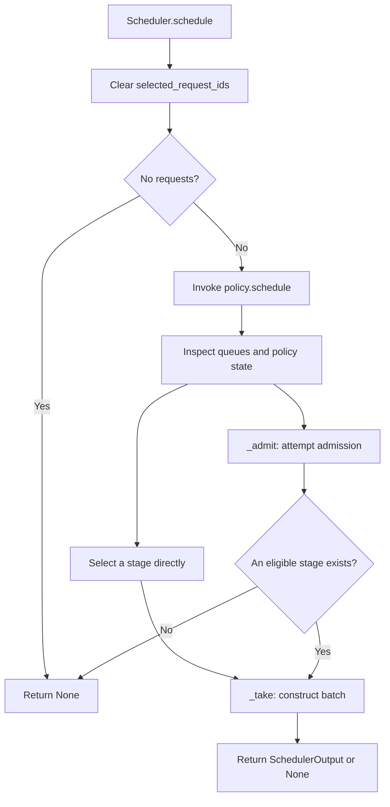
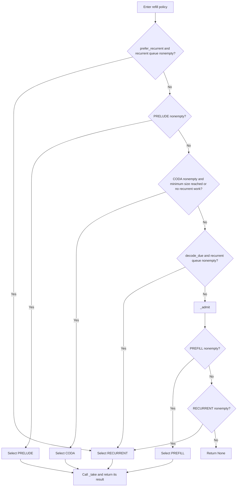
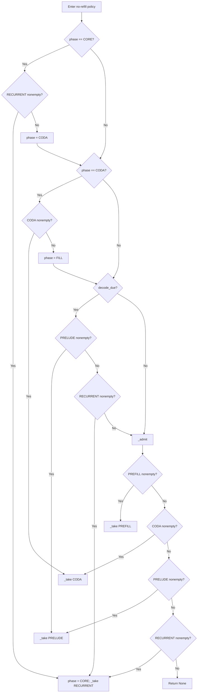
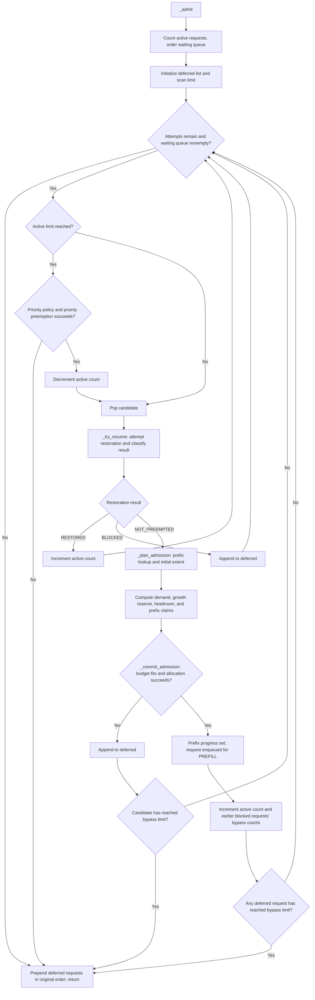
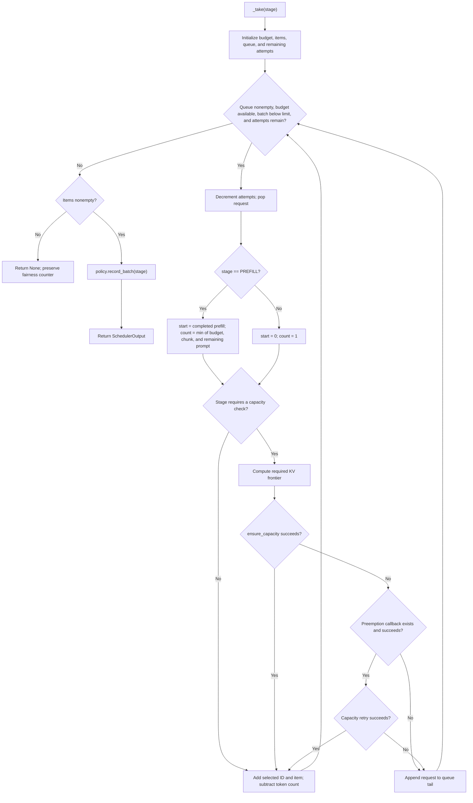

# Scheduler Responsibilities and Control Flow

This note documents the first Scheduler-focused increment of the M3 refactor:

- [scheduler.py](../vllm_rlt/core/scheduler.py): request registration, termination, admission, and batch construction.
- [scheduling_policy.py](../vllm_rlt/core/scheduling_policy.py): refill/no-refill stage selection and fairness state.
- [request.py](../vllm_rlt/request.py): request stages, termination reasons, and output conversion.
- [preemption.py](../vllm_rlt/engine/preemption.py): preemption and restoration callbacks.

## Design rationale

When requests share a GPU, the scheduler must determine which requests may enter execution, which stage should run next, and which requests can be executed together.

```text
schedule: inspect outstanding work and select a stage or admission opportunity
    ↓ when the policy permits admission
_admit: order waiting requests → obtain a slot → restore or allocate → enqueue or defer
    ↓ after selecting a stage
_take: determine work ranges → ensure KV capacity → assemble the batch
```

Admission cannot wait for every active request to finish. With a concurrency limit of eight and one long-running request, subsequent short requests should be able to use the remaining slots. Conversely, unconditionally prioritizing admission can delay existing decode work. Stage selection therefore remains in the scheduling policy, which determines when `_admit()` runs.

`SchedulingPolicy`, `RefillPolicy`, and `NoRefillPolicy` own stage selection and fairness state. Admission and batch construction remain in `Scheduler`, organized through focused helpers. `AdmissionPlan` names the values needed for one admission attempt; `ResumeResult` makes the restoration callback's three outcomes explicit.

### Helper responsibilities

| Main operation | Helper | Responsibility |
| --- | --- | --- |
| `_admit` | `_order_waiting_requests` | Establish admission order under the configured policy |
| `_admit` | `_ensure_active_slot` | Check for a slot or attempt priority-based preemption |
| `_admit` | `_try_resume` | Distinguish fresh admission, successful restoration, and blocked restoration |
| `_admit` | `_plan_admission` | Calculate prefix reuse, initial allocation extent, and capacity budget |
| `_plan_admission` | `_reserved_growth_blocks` | Account for future growth of existing requests |
| `_admit` | `_commit_admission` | Allocate within budget and enqueue the request for PREFILL |
| `_take` | `_make_scheduled_item` | Describe the token range to execute |
| `_take` | `_ensure_execution_capacity` | Obtain capacity, optionally through preemption and one retry |
| `preempt` | `_is_preemption_candidate` | Apply safety and priority eligibility checks |
| `preempt` | `_select_preemption_victim` | Rank eligible victims |

Short operations such as budget subtraction, enqueueing, and bypass-counter updates remain in the main control flow.

### Case 1: caller-supplied priority

```text
Waiting queue:
A priority=10
B priority=-5
C priority=0
D priority=0

priority policy: B → C → D → A
fcfs policy:     A → B → C → D
```

Priority defaults to zero; lower values take precedence. Equal values retain their current queue order. Priority is not inferred from prompt length or dynamically adjusted by waiting time. This ordering governs admission attempts, not execution order within every active stage queue.

When the active-request limit is reached, priority admission can preempt only a request with strictly lower priority. Preemption under memory pressure does not impose that restriction: it first selects the largest priority value, then breaks ties using KV demand at the current position. This is not an exact ranking by reclaimable physical pages. Both selection rules are preserved.

### Case 2: free pages do not imply admissible capacity

Assume `block_size=4` and `last_exited` with four storage depths. Covering four token positions requires four physical blocks.

```text
Total cache capacity: 16 blocks
Active request A: prompt=8, max_tokens=5; maximum demand=12 blocks
A currently holds 4 blocks under incremental allocation, leaving free=12

Without preemption:
  A's reserved_growth_blocks = 12 - 4 = 8
  Candidate B requires 8 blocks
  8 + 8 > 12: defer B
```

Admitting B could otherwise leave A unable to acquire the pages needed to complete.

`AdmissionPlan` distinguishes `capacity_tokens`, `initial_tokens`, `prefix_blocks`, and `cached_tokens` from four physical-block budget terms. `total_budget_blocks` sums `required_blocks`, `reserved_growth_blocks`, `admission_headroom_blocks`, and `cached_claim_blocks`. Creating the plan does not reserve physical pages.

Prefix lookup in `_plan_admission()` can publish completed prefixes and update LRU order, so planning is not a pure read. `_commit_admission()` attempts allocation and, on success, sets prefill progress and enqueues the request. Budget helpers still access private KV allocation and reference-count structures; a public cross-module resource interface remains future work.

### Case 3: bounded bypass of a blocked request

```text
free=8
Waiting: [A requires 12 blocks, B requires 4, C requires 4]
max_admission_bypasses=1

A: allocation cannot fit; append to deferred
B: enter PREFILL; increment A's bypass count to 1
The bypass limit is reached; stop scanning
Restore the waiting queue as [A,C]
```

C cannot continue bypassing A once A reaches the protection threshold. Bypass counters increase when a later fresh request is admitted successfully. Restoration retains its existing separate accounting path.

### Case 4: constructing a prefill batch

```text
token_budget=6, chunk_size=4, queue=[A,B,C]
A: prompt length=10, completed=4
B: prompt length=3, completed=0
C: prompt length=2, completed=0

A: start=4, count=min(6,4,6)=4; execute [4,8)
   Ensure KV covers the first 8 positions; select A; remaining budget=2
B: start=0, count=min(2,4,3)=2; execute [0,2)
   Ensure KV covers the first 2 positions; select B; remaining budget=0
C: remain queued
```

If A cannot obtain capacity, it returns to the queue tail and the scheduler tries B and C. `_take()` describes scheduled work; it does not advance completed progress. Execution-result processing in the Engine still owns that update.

### Case 5: callbacks perform stateful operations

```text
A has already been selected for the current batch
B needs additional KV capacity, but no pages are available
_ensure_execution_capacity(B)
    → initial growth attempt fails
    → preempt_callback(B)
         exclude B, selected A, receiving requests,
           requests with pending outputs, and requests holding transfer leases
         select an eligible victim C
         synchronize, save C's KV/hidden state, release resources,
           and return C to WAITING
    → retry B's growth attempt
```

When C is considered again, `_admit()` calls `_try_resume()`. The existing callback contract is translated as follows:

| Callback return | `ResumeResult` | Meaning |
| --- | --- | --- |
| `None` | `NOT_PREEMPTED` | No snapshot exists; proceed with fresh admission |
| `True` | `RESTORED` | State is restored and the saved stage is already enqueued |
| `False` | `BLOCKED` | A snapshot exists, but restoration cannot obtain capacity |

`_ensure_active_slot()` returns the updated active count, or `None` when admission must stop. Zero is a valid count, so callers test `is None` rather than truthiness.

## 1. Changes and scope

| Concern | Result |
| --- | --- |
| No-refill phase | `NoRefillPolicy` owns `NoRefillPhase`: FILL, CORE, CODA; refill instances have no phase field |
| Prefill fairness counter | `SchedulingPolicy` owns the counter and records only nonempty scheduled batches |
| Termination reason | `Request` uses `FinishReason`; `RequestOutput` converts it to a plain string |
| Cancellation cleanup | `abort()` delegates to `finish()`, removing duplicate queue cleanup |
| Selected-request protection | `protected` becomes `selected_request_ids`, identifying requests excluded from subsequent preemption |
| Batch return contract | `_take()` explicitly returns `SchedulerOutput` or `None` |

The intentional accounting fix is that an empty batch neither increments the prefill counter nor resets it for recurrent execution. Accounting occurs when a nonempty batch is scheduled, without waiting for GPU completion.

Admission budgets, priority rules, callback contracts, and stage ordering are preserved. If `_take()` returns `None` for the selected stage, scheduling still does not fall back to another stage. Private KV access and direct PD calls to `_take()` remain unchanged architectural dependencies.

## 2. Configuration and runtime state

| Category | Name | Meaning |
| --- | --- | --- |
| Configuration | `max_prefill_batches_before_decode` | Prefill fairness threshold |
| Policy state | `prefill_batches_since_recurrent` | Nonempty prefill batches scheduled since the last nonempty recurrent batch |
| No-refill state | `phase` | FILL, CORE, or CODA |
| Current selection state | `selected_request_ids` | Requests already selected and excluded from subsequent capacity-driven preemption |

FILL prepares the next group of recurrent work; it is distinct from request stage `Stage.PREFILL`. CORE drains recurrent work, CODA processes tokens leaving recurrence, and the policy then returns to FILL.

A nonempty PREFILL batch increments the counter, a nonempty RECURRENT batch resets it, and PRELUDE/CODA leave it unchanged. `_take()` calls `record_batch()` after assembling a nonempty batch, including when PD invokes `_take()` directly.

## 3. Scheduling, admission, and batch construction

- `schedule()` chooses a stage and invokes admission when the policy permits it.
- `_admit()` moves waiting requests into execution queues when resources permit.
- `_take()` constructs a batch for the selected stage within token, sequence, and KV constraints.

A scheduling call need not attempt admission. Successful admission does not imply that model execution has occurred.



If no stage is eligible after admission, the policy returns `None` without calling `_take()`.

## 4. Refill policy



The CODA condition requires a nonempty CODA queue and either the minimum batch size or an empty recurrent queue. `prefer_recurrent` is an external hint for overlapping execution; the policy does not inspect CUDA events. `decode_due` indicates that the prefill count has reached its configured threshold.

## 5. No-refill policy



No-refill ignores `prefer_recurrent`. Every `_take` node returns its result directly.

## 6. Admission flow



The admission constraint is:

```text
required_blocks + reserved_growth_blocks + admission_headroom_blocks + cached_claim_blocks <= num_free_blocks
```

- `required_blocks`: candidate demand after subtracting reusable prefix blocks.
- `reserved_growth_blocks`: capacity budgeted for existing requests' future growth, including decode growth when preemption is unavailable.
- `admission_headroom_blocks`: `watermark_blocks` when active requests exist; otherwise zero.
- `cached_claim_blocks`: reusable prefix blocks that become non-evictable when referenced by the candidate.

`capacity_tokens` equals prompt length plus `max_tokens - 1`: the final sampled token is not fed back into the model. `initial_tokens` defines the extent covered by the initial allocation, usually through the next prefill chunk under incremental allocation.

`resume_callback` returns `None` for no snapshot, `True` for completed restoration and enqueueing, or `False` for blocked restoration. `preempt_callback` receives the request needing resources and selects a different request as the victim.

## 7. Batch construction flow



Capacity checks apply to PREFILL, PRELUDE, and RECURRENT. CODA does not request growth here. The initial queue length bounds attempts, preventing blocked requests from cycling indefinitely within one call.

`_take()` does not advance `loops_done` or `num_prefilled_tokens`; the Engine's execution-result path still advances completed progress.

## 8. Protecting selected requests

Suppose A is selected before B, and B's failed growth attempt triggers preemption. Preempting A at that point would invalidate resources referenced by the batch under construction. Selected requests must therefore be excluded from subsequent victim selection.

`schedule()` clears `selected_request_ids` at entry; `_take()` adds each selected request. The set is not a GPU-completion indicator and does not replace Runner events or synchronization. The preemption manager currently reads it directly; a future interface may pass explicit excluded request IDs instead.

## 9. Termination reasons and cleanup

`FinishReason` defines STOP, LENGTH, and ABORT. Internal requests hold enum values; external outputs retain the plain strings `stop`, `length`, and `abort`. `None` indicates no termination reason has been assigned.

`abort()` retrieves the request and calls `finish(request, FinishReason.ABORT)`. `finish()` removes all queue occurrences, requests KV release, marks the request finished, clears request resources, and unregisters it. Runner cleanup and GPU safety remain responsibilities of the surrounding call chain. Transfer leases may defer physical KV release.

## 10. Validation

Existing regressions cover refill/no-refill, starvation prevention, bounded bypass, asynchronous outputs, preemption/restoration, and serving output. Added cases verify that:

- A failed prefill batch does not consume the prefill fairness allowance.
- A failed recurrent batch does not reset `decode_due`.
- Cancellation removes duplicate and cross-stage queue entries and releases request resources.
- Every termination enum serializes to an ordinary string.

The implementation was validated with **150 passed, 40 skipped** using:

```bash
python -m pytest -q tests/test_engine.py tests/test_cdb_runtime.py \
  tests/test_prefix_growth.py tests/test_async_pipeline.py \
  tests/test_serving.py tests/test_pd.py
```

Changed-file Ruff lint, formatting checks, and the complete PR whitespace check passed. These CPU results do not establish GPU correctness, model quality, or performance; those require separate evaluation.

## 11. Function contracts, arguments, and units

Interfaces should expose required inputs, distinguish outcomes, and make resource mutations explicit. FILL and fairness counters are internal policy state, not caller-supplied configuration.

| Interface | Input contract | Result and side effects |
| --- | --- | --- |
| `finish(request, reason: FinishReason)` | Request and a finite termination reason | Clear queues, release KV, and clear request state; serialize to a string at the output boundary |
| `_ensure_active_slot(requester, active_count)` | Candidate and current active count | Updated count or `None`; may preempt and mutate queues; zero is valid |
| `_try_resume(request)` | Waiting candidate | Three-way `ResumeResult`; successful restoration has already acquired resources and enqueued work |
| `_reserved_growth_blocks(*, reserve_outputs)` | Keyword-only choice to include future output growth | Physical-block budget; does not reserve pages |
| `_plan_admission(request, active_count)` | Request demand and current active count | `AdmissionPlan`; prefix lookup may update LRU order or publish completed prefixes |
| `_commit_admission(request, plan)` | Request and named allocation/budget plan | Boolean; successful allocation transitions the request to PREFILL |
| `_make_scheduled_item(request, stage, token_budget)` | Stage and remaining token budget | `ScheduledItem`; describes work without advancing completed progress |
| `_ensure_execution_capacity(request, frontier)` | Required token extent, expressed as an exclusive upper bound | Boolean; may allocate, preempt, and retry. Range [4,8) requires coverage through the first eight positions |
| `_take(stage)` | Stage already selected by policy | Nonempty `SchedulerOutput` or `None`; mutates queues and accounts for nonempty batches |
| `CacheConfig(watermark_ratio=...)` | Fraction of total physical blocks used as admission headroom | Converted to `watermark_blocks`; admission determines whether to include it |

### Watermark naming and units

- `CacheConfig.watermark_ratio` is a ratio in `[0,1)`, defaulting to zero.
- The `KVCacheManager` constructor accepts the same ratio as `watermark_ratio`.
- `KVCacheManager.watermark_blocks` equals `int(watermark_ratio * num_blocks)` and is measured in physical blocks.
- `AdmissionPlan.admission_headroom_blocks` is the headroom included in a particular admission attempt: the watermark block count when active requests exist, or zero otherwise.

For 100 blocks and `watermark_ratio=0.1`, `watermark_blocks=10`. An admission attempt with existing active work includes those ten blocks in its budget. An idle engine includes zero so a large request can start. This is an admission margin, not a separate allocation of ten blocks. The budget algorithm is unchanged.

### Caller migration

Python callers must replace `CacheConfig(watermark=...)` and `KVCacheManager(watermark=...)` with `watermark_ratio=...`. The internal block-count attribute changes from `watermark` to `watermark_blocks`.

The CLI retains `--kv-watermark`, whose value is a ratio. The existing PD `watermark_blocks` field remains unchanged. Internal `finish()` calls use `FinishReason`; the public `RequestOutput` string protocol remains unchanged.

## 12. Reusable refactoring categories

| Category | Example in this increment | Review question for subsequent modules |
| --- | --- | --- |
| Responsibility separation | Stage policy separated from admission and batch construction | Does a component mix policy, resource allocation, and device execution? |
| State ownership | No-refill phase belongs to `NoRefillPolicy`; fairness state belongs to the policy | Who initializes, advances, and resets state? Is runtime state confused with configuration? |
| Type safety | `FinishReason`, `NoRefillPhase`, `ResumeResult` | Do strings or booleans obscure finite states or distinct outcomes? |
| Named data contracts | `AdmissionPlan` groups allocation inputs and budget terms | Are fields explicit about meaning, units, and lifetime? |
| Function interfaces and arguments | Explicit active count, token budget, frontier, keyword-only switches, and optional returns | Are dependencies visible and zero distinguishable from failure? |
| Control-flow simplification | `_admit()` and `_take()` follow named operational steps | Can the main path be understood before inspecting each helper? |
| Decision/mechanism separation | Eligibility and victim ranking separated from snapshot operations | Can a selection rule change independently of device resource handling? |
| Unified cleanup | `abort()` delegates to `finish()` | Do termination paths duplicate cleanup and risk divergence? |
| Naming and units | `selected_request_ids`, `watermark_ratio`, `watermark_blocks` | Does each name express purpose, scope, and unit? |
| Rationale and walkthrough documentation | Admission, bypass, capacity failure, and callback cases with flowcharts | Are motivations and failure paths explained alongside successful execution? |
| Regression validation | Fairness failures, termination cleanup, and string serialization | Which invariants must survive the restructuring? |
| Explicit behavioral fixes | Empty batches no longer alter fairness accounting | Is each behavior change identified separately and tested? |

These categories are a review reference, not a requirement to introduce policy or data classes in every module. Prioritize concrete comprehension and maintenance problems. This increment does not complete M3: Scheduler/KV private access, Engine-owned result progression, and PD private scheduling calls remain future work.
